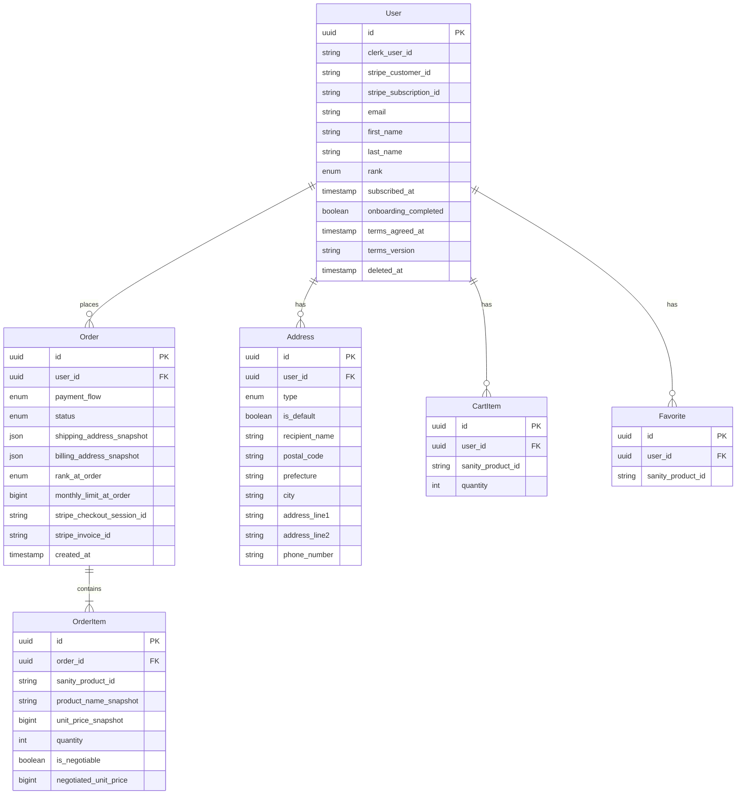

# 概念データモデル

> 🔒 **凍結済みドキュメント**: `docs/archive/` に移動済み。直接編集しない。このトピックへの変更は `specs/` 配下の仕様駆動開発ワークフロー（`docs/spec-driven-workflow.md` 参照）で行うこと。本ファイルは移行時点のスナップショットとして保持する。

SQL ではなく概念レベルの定義。エンティティの責務・関係・スナップショット設計の方針を記述する。
スキーマ実装時はこのドキュメントを唯一の設計根拠とすること。

> ⚠️ **現状の実装について**: 以下の `rank` enum（`free` / `entry` / `standard` / `pro` / `enterprise`）は現在のDB・コードの実装と一致している。ただし `service-spec.md` は既に7ランクモデル（STARTER〜ENTERPRISE）に更新済みで、コード側の移行は未着手（[BRAND-97](https://linear.app/wknd-studio/issue/BRAND-97)）。このドキュメントは移行が完了するまで現行の5ランクのまま維持し、BRAND-97着手時に本ドキュメントも更新すること。

---

## データ管理の担当システム

| エンティティ                      | 管理システム | 備考                                            |
| --------------------------------- | ------------ | ----------------------------------------------- |
| User（会員）                      | Supabase     | 認証情報は Clerk が保持、サブスクはStripeが保持 |
| Address（住所）                   | Supabase     | 請求先・お届け先の両タイプを管理                |
| Order（注文）                     | Supabase     | Stripe Invoice ID を外部キーとして保持          |
| OrderItem（注文明細）             | Supabase     | 価格・商品名はスナップショットとして記録        |
| CartItem（カートアイテム）        | Supabase     | Sanity 商品 ID を参照                           |
| Favorite（お気に入り）            | Supabase     | Sanity 商品 ID を参照                           |
| Product（商品）                   | Sanity       | ランク別価格・ランク制限・ファイルを含む        |
| Announcement（お知らせ）          | Sanity       |                                                 |
| Customer / Subscription / Invoice | Stripe       | Supabase からは ID のみ保持                     |
| 認証情報 / 運営者ロール           | Clerk        | Supabase からは clerk_user_id のみ保持          |

---

## エンティティ定義（Supabase 管理）

### User（会員）

| 属性                   | 型                 | 説明                                                 |
| ---------------------- | ------------------ | ---------------------------------------------------- |
| id                     | UUID PK            |                                                      |
| clerk_user_id          | string UNIQUE      | Clerk ユーザー ID（認証連携キー）                    |
| stripe_customer_id     | string UNIQUE      | Stripe Customer ID                                   |
| stripe_subscription_id | string UNIQUE      | Stripe Subscription ID（Free は null）               |
| email                  | string             |                                                      |
| first_name             | string             |                                                      |
| last_name              | string             |                                                      |
| rank                   | enum               | `free` / `entry` / `standard` / `pro` / `enterprise` |
| subscribed_at          | timestamp          | サブスク登録日。月次リセット日の起点                 |
| onboarding_completed   | boolean            | false の間は `/onboarding` にリダイレクト            |
| terms_agreed_at        | timestamp nullable | 利用規約同意日時（selectPlan 実行時刻を記録）        |
| terms_version          | string nullable    | 同意時の規約バージョン（例: `"2026-05-25"`）         |
| deleted_at             | timestamp nullable | 論理削除。退会後もデータは保持                       |

### Address（住所）

| 属性                 | 型              | 説明                                        |
| -------------------- | --------------- | ------------------------------------------- |
| id                   | UUID PK         |                                             |
| user_id              | UUID FK → User  |                                             |
| type                 | enum            | `billing`（請求先）/ `shipping`（お届け先） |
| is_default           | boolean         | 各 type ごとに1件のみ true にする           |
| recipient_last_name  | string          | 受取人 姓                                   |
| recipient_first_name | string          | 受取人 名                                   |
| postal_code          | string          |                                             |
| prefecture           | string          | 都道府県                                    |
| city                 | string          | 市区町村                                    |
| address_line1        | string          | 番地                                        |
| address_line2        | string nullable | 建物名・部屋番号                            |
| phone_number         | string          |                                             |

### Order（注文）

| 属性                       | 型              | 説明                                                                                                                                       |
| -------------------------- | --------------- | ------------------------------------------------------------------------------------------------------------------------------------------ |
| id                         | UUID PK         |                                                                                                                                            |
| user_id                    | UUID FK → User  |                                                                                                                                            |
| payment_flow               | enum            | `checkout` / `invoice`。注文確定時に決定し変更不可                                                                                         |
| status                     | enum            | `pending_payment` / `confirming` / `invoice_sent` / `paid` / `sourcing` / `ordered` / `preparing` / `shipping` / `delivered` / `cancelled` |
| shipping_address_snapshot  | JSON            | 注文時点のお届け先住所（Address の値コピー）                                                                                               |
| billing_address_snapshot   | JSON            | 注文時点の請求先住所（Address の値コピー）                                                                                                 |
| rank_at_order              | enum            | 注文時点の会員ランク                                                                                                                       |
| monthly_limit_at_order     | bigint          | 注文時点のプランの月次上限額（円）。上限チェックに使用                                                                                     |
| stripe_checkout_session_id | string nullable | Stripe Checkout Session ID。Checkout フローのみ記録                                                                                        |
| stripe_invoice_id          | string nullable | Stripe Invoice ID。Invoice フローのみ記録                                                                                                  |
| created_at                 | timestamp       |                                                                                                                                            |

> `shipping_address_snapshot` / `billing_address_snapshot` は JSON スナップショット。住所が後から変更・削除されても注文時の情報が保持される。

> `stripe_checkout_session_id` と `stripe_invoice_id` はどちらか一方のみ設定される。`payment_flow` で判別する。

### OrderItem（注文明細）

| 属性                  | 型              | 説明                                                     |
| --------------------- | --------------- | -------------------------------------------------------- |
| id                    | UUID PK         |                                                          |
| order_id              | UUID FK → Order |                                                          |
| sanity_product_id     | string          | Sanity の商品ドキュメント ID                             |
| product_name_snapshot | string          | 注文時点の商品名スナップショット                         |
| unit_price_snapshot   | bigint nullable | 注文時点の単価スナップショット（円）。要相談商品は null  |
| quantity              | integer         |                                                          |
| is_negotiable         | boolean         | 要相談商品フラグ                                         |
| negotiated_unit_price | bigint nullable | 運営者が請求書発行時に確定した単価（円）。要相談商品のみ |

### CartItem（カートアイテム）

| 属性              | 型             | 説明                         |
| ----------------- | -------------- | ---------------------------- |
| id                | UUID PK        |                              |
| user_id           | UUID FK → User |                              |
| sanity_product_id | string         | Sanity の商品ドキュメント ID |
| quantity          | integer        |                              |

### Favorite（お気に入り）

| 属性              | 型             | 説明                         |
| ----------------- | -------------- | ---------------------------- |
| id                | UUID PK        |                              |
| user_id           | UUID FK → User |                              |
| sanity_product_id | string         | Sanity の商品ドキュメント ID |

---

## エンティティ定義（Sanity 管理）

Supabase のテーブルは持たない。Sanity Content API 経由で取得する。

### Product（商品）

| 属性         | 型       | 説明                                                      |
| ------------ | -------- | --------------------------------------------------------- |
| \_id         | string   | Sanity ドキュメント ID                                    |
| name         | string   | 商品名                                                    |
| brand        | string   | ブランド名                                                |
| categories   | string[] | カテゴリ                                                  |
| description  | text     | 説明文                                                    |
| images       | file[]   | 商品画像                                                  |
| files        | file[]   | スペックシート・仕様書 PDF 等                             |
| prices       | object   | ランク別価格 `{ free, entry, standard, pro, enterprise }` |
| min_rank     | enum     | 最低閲覧ランク（これ未満のランクには非表示）              |
| availability | enum     | `available` / `out_of_stock` / `discontinued`             |

### Announcement（お知らせ）

| 属性         | 型        | 説明                   |
| ------------ | --------- | ---------------------- |
| \_id         | string    | Sanity ドキュメント ID |
| title        | string    | タイトル               |
| body         | rich text | 本文                   |
| published_at | datetime  | 公開日時               |

---

## ER 図



---

## スナップショット設計の方針

注文後に商品価格・住所・プランが変更されても注文時の情報が変わらないよう、以下をスナップショットとして記録する。

| スナップショット対象 | 記録タイミング | 記録先                          |
| -------------------- | -------------- | ------------------------------- |
| 商品名               | 注文確定時     | OrderItem.product_name_snapshot |
| 商品単価（固定価格） | 注文確定時     | OrderItem.unit_price_snapshot   |
| 商品単価（要相談）   | 請求書発行時   | OrderItem.negotiated_unit_price |
| お届け先住所         | 注文確定時     | Order.shipping_address_snapshot |
| 請求先住所           | 注文確定時     | Order.billing_address_snapshot  |
| 注文時の会員ランク   | 注文確定時     | Order.rank_at_order             |
| 注文時の月次上限額   | 注文確定時     | Order.monthly_limit_at_order    |

---

## 月次仕入れ上限の算出ロジック

### 当月期間の定義

```
期間開始日 = User.subscribed_at の「日」を当月に当てはめた日付
例: subscribed_at = 2025-01-15 → 当月期間 = 2026-05-15 〜 2026-06-14
```

### 注文時チェック

**Checkout フロー**（全商品が固定価格）:

```
使用済み額 = 当期間内のキャンセルされていない注文の
             全 OrderItem の unit_price_snapshot × quantity の合計
```

合計が `User.rank の月次上限` を超える場合は Checkout Session の作成をブロックする。

**Invoice フロー**（要相談商品を含む）:

```
使用済み額 = 当期間内のキャンセルされていない注文の
             固定価格 OrderItem (is_negotiable = false) の
             unit_price_snapshot × quantity の合計
```

固定価格商品の合計が `User.rank の月次上限` を超える場合は注文をブロックする。

### 請求書発行時チェック（Invoice フロー・全商品）

```
使用済み額 = 当期間内のキャンセルされていない注文の
             固定価格 OrderItem: unit_price_snapshot × quantity
             要相談 OrderItem: negotiated_unit_price × quantity
             の合計
```

チェックに使う上限は `Order.monthly_limit_at_order`（注文時点のプランの上限）。ダウングレード後に請求書を発行する場合も、注文時点の上限を適用する。
