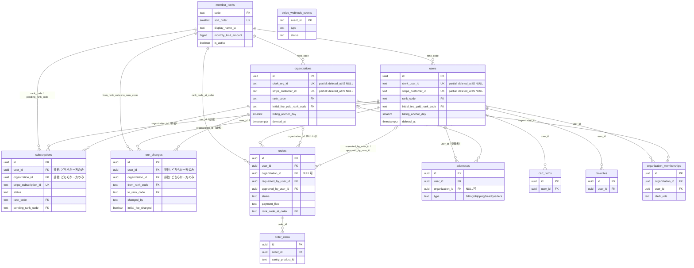

# DBスキーマ再設計（v2）

## 位置づけ

`supabase/migrations/` に積み上がった現行スキーマを、Clerk（個人 = User / 法人 = Organization）× Stripe（初期費用・月額・都度課金）という前提に対してレビューした結果、以下の指摘が出た。本ドキュメントはその是正案を **マイグレーション実行前の設計** としてまとめたもの。マイグレーションファイルは別途、本ドキュメント確定後に段階分割して作成する。

現行スキーマの実体は `supabase/migrations/20260516160953_initial_schema.sql` 以降の全マイグレーション（2026-08-12 時点、develop HEAD `c866670` まで反映済み）。

## 指摘事項との対応表（トレーサビリティ）

| #         | レビューでの指摘                                                                                        | 本設計での対応                                                                                                                                                                                      |
| --------- | ------------------------------------------------------------------------------------------------------- | --------------------------------------------------------------------------------------------------------------------------------------------------------------------------------------------------- |
| 1         | `users`/`organizations` で Stripe 関連カラムの制約が非対称（`UNIQUE`の有無）                            | Stripeサブスクリプション状態を `subscriptions` テーブルに正規化して分離。残る `stripe_customer_id` は両テーブルとも部分UNIQUEに統一（→指摘3とセットで解消）                                         |
| 2         | Webhookのべき等性を担保するテーブルが無い                                                               | `stripe_webhook_events` を新設。`event.id` を主キーで先着1件のみ受理する                                                                                                                            |
| 3         | `deleted_at` と `UNIQUE` の組み合わせで論理削除後の再登録が破綻する                                     | 該当カラムをすべて `WHERE deleted_at IS NULL` の部分UNIQUEインデックスに変更                                                                                                                        |
| 4         | 個人/法人で月次期間の起点（`billing_anchor_day`）の持ち方が非対称                                       | `users` にも `billing_anchor_day` を追加し、両テーブルで同じ方法により期間を算出する                                                                                                                |
| 5         | 住所スキーマが `addresses` と `organizations` 直書きカラムの2箇所に重複                                 | 組織の本店所在地も `addresses`（`type='headquarters'`）に統合し、`organizations` から住所カラムを削除                                                                                               |
| 6         | ENUM と TEXT+CHECK が場当たり的に混在。`member_rank` はENUM値追加のトランザクション制約で運用負債化済み | `member_rank` は参照テーブル `member_ranks` に変更（行データ化）。`order_status`/`order_payment_flow`/`address_type` はTEXT+CHECKに統一し、`approval_status`/`clerk_role`（既にTEXT+CHECK）と揃える |
| 7         | サブスクリプション状態が「今の値」のみで変更履歴を追えない                                              | `rank_changes`（追記専用の履歴テーブル）を新設。`subscriptions` は現在値のミラー、`rank_changes` が来歴を持つ、という役割分担にする                                                                 |
| 8（軽微） | `updated_at` トリガーの有無がテーブルによってバラバラ                                                   | 全テーブルに統一（`favorites`のみ性質上不要と判断し明記）                                                                                                                                           |
| 9（軽微） | `sanity_product_id` の外部整合性チェックが無い                                                          | 本設計のスコープ外として維持（Sanityは別システムであり、DB側でのFK参照は不可能。将来的に整合性チェックバッチを設けることを課題として明記するに留める）                                              |

---

## 設計原則

1. **Stripeは決済の正、Supabaseは参照用ミラー。** Webhook受信時にStripeオブジェクトの状態をそのまま複写する。Supabase側で決済状態を独自に推測・計算しない。
2. **「今の状態」と「来歴」を別テーブルに分離する。** `users`/`organizations`/`subscriptions` は現在値のみを持つ（上書き型）。変更の経緯が必要なものは追記専用の履歴テーブル（`rank_changes`）に外出しする。
3. **個人（User）と法人（Organization）は同じ概念を同じ形で表現する。** 課金・ランク・住所まわりのカラム構成を非対称にしない。共通化できるものは共通テーブルへ、できないものは同じ命名・同じ制約パターンで両テーブルに持つ。
4. **頻繁に値が増減する分類値はENUMにしない。** Postgres ENUMへの値追加は同一トランザクション内で使えない等の制約があり、実際に7ランク移行時（`20260720084006`/`20260720084116`）で運用負債になった。順序を持つ分類（ランク）は行データの参照テーブル、それ以外の状態値はTEXT+CHECKに統一する。
5. **論理削除するテーブルの一意制約は必ず部分インデックスにする。** 物理削除しない設計を選ぶ以上、`deleted_at IS NULL` を条件に含めない一意制約は原則禁止とする。
6. **決済のべき等性はDBで担保する。** アプリケーションコードの実装依存にせず、Webhookイベントの受理可否をDBの一意制約で判定する。

---

## ER概要



`stripe_webhook_events` は他テーブルと関連を持たない独立ログのため、上図では単独エンティティとして扱う（Stripeの `event.id` をそのまま主キーにする）。

`subscriptions` と `rank_changes` は「所有者が `users` か `organizations` のどちらか一方」という排他的関連（exclusive arrow）を、`owner_type`+`owner_id` のポリモーフィック関連ではなく **2本のnullable FKカラム + CHECK制約** で表現する。理由は、Postgresのポリモーフィック関連（`owner_type TEXT` + `owner_id UUID`）はFK制約による参照整合性チェックができず、存在しないIDを指しても検知できないため。2本のFKカラムなら通常のFK制約がそのまま効く。

---

## テーブル定義

### `member_ranks`（新設・参照テーブル）

`member_rank` ENUMを置き換える。ランクは「順序を持つ・増減しうる分類」であり、ENUMではなく行データとして持つ。

| カラム                        | 型          | 制約                   | 説明                                                                                     |
| ----------------------------- | ----------- | ---------------------- | ---------------------------------------------------------------------------------------- |
| `code`                        | TEXT        | PK                     | `starter` / `basic` / `standard` / `pro` / `advanced` / `premium` / `enterprise`         |
| `sort_order`                  | SMALLINT    | NOT NULL, UNIQUE       | ランクの序列（`isHigherThan`等の比較に使用）                                             |
| `display_name_ja`             | TEXT        | NOT NULL               | 画面表示名                                                                               |
| `monthly_limit_amount`        | BIGINT      | NULL可                 | 月間仕入れ上限。NULL = 無制限（enterprise想定）                                          |
| `stripe_monthly_price_id`     | TEXT        | NULL可                 | 月額サブスクリプションのStripe Price ID（¥0プランはNULL）                                |
| `stripe_initial_fee_price_id` | TEXT        | NULL可                 | 初期費用のStripe Price ID                                                                |
| `is_active`                   | BOOLEAN     | NOT NULL DEFAULT true  | 新規販売を停止したランクは `false`。**行を削除しない**（他テーブルのFKが指しているため） |
| `created_at`                  | TIMESTAMPTZ | NOT NULL DEFAULT NOW() |                                                                                          |
| `updated_at`                  | TIMESTAMPTZ | NOT NULL DEFAULT NOW() |                                                                                          |

金額そのものの正はStripeダッシュボード（Price）とする。`monthly_limit_amount`のような業務ロジック固有の値のみDBを正とする。

---

### `users`（変更）

| カラム                       | 型          | 制約                                                     | 変更内容                                                                                                                                                                                                                               |
| ---------------------------- | ----------- | -------------------------------------------------------- | -------------------------------------------------------------------------------------------------------------------------------------------------------------------------------------------------------------------------------------- |
| `id`                         | UUID        | PK                                                       | 変更なし                                                                                                                                                                                                                               |
| `clerk_user_id`              | TEXT        | NOT NULL、**部分UNIQUE** `WHERE deleted_at IS NULL`      | 指摘3対応                                                                                                                                                                                                                              |
| `stripe_customer_id`         | TEXT        | NULL可、**部分UNIQUE** `WHERE deleted_at IS NULL`        | 指摘1・3対応。Subscription IDはここから削除                                                                                                                                                                                            |
| ~~`stripe_subscription_id`~~ | —           | 削除                                                     | `subscriptions` テーブルへ移動                                                                                                                                                                                                         |
| `email`                      | TEXT        | NOT NULL                                                 | 変更なし                                                                                                                                                                                                                               |
| `first_name` / `last_name`   | TEXT        | NOT NULL DEFAULT ''                                      | 変更なし                                                                                                                                                                                                                               |
| `phone_number`               | TEXT        | NOT NULL DEFAULT ''                                      | 変更なし                                                                                                                                                                                                                               |
| `rank_code`                  | TEXT        | NOT NULL, FK → `member_ranks(code)`, DEFAULT `'starter'` | 旧 `rank`。参照テーブルのcodeを指す非正規化キャッシュ（authorizationチェックで高頻度に読むため、`subscriptions`/`rank_changes`からJOINせず直接引けるようにする）。更新は必ず `rank_changes` へのINSERTとセットのトランザクションで行う |
| `billing_anchor_day`         | SMALLINT    | NULL可, CHECK `BETWEEN 1 AND 28`                         | **新設。指摘4対応。** `organizations` と同じ方法で月次期間を算出する                                                                                                                                                                   |
| `initial_fee_paid_rank_code` | TEXT        | NULL可, FK → `member_ranks(code)`                        | 旧 `initial_fee_paid_rank`。命名を `organizations` と統一                                                                                                                                                                              |
| ~~`subscribed_at`~~          | —           | 削除                                                     | `rank_changes` の最古行から導出可能なため冗長カラムを廃止                                                                                                                                                                              |
| `onboarding_completed`       | BOOLEAN     | NOT NULL DEFAULT false                                   | 変更なし                                                                                                                                                                                                                               |
| `profile_completed_at`       | TIMESTAMPTZ | NULL可                                                   | 変更なし                                                                                                                                                                                                                               |
| `deleted_at`                 | TIMESTAMPTZ | NULL可                                                   | 変更なし                                                                                                                                                                                                                               |
| `created_at` / `updated_at`  | TIMESTAMPTZ | NOT NULL DEFAULT NOW()                                   | `updated_at`トリガーは維持                                                                                                                                                                                                             |

`terms_agreed_at`/`terms_version`/`can_invite`/`invite_limit` は既存マイグレーションで削除済み（本設計でも据え置き）。

---

### `organizations`（変更）

| カラム                                                                                        | 型          | 制約                                                     | 変更内容                                                   |
| --------------------------------------------------------------------------------------------- | ----------- | -------------------------------------------------------- | ---------------------------------------------------------- |
| `id`                                                                                          | UUID        | PK                                                       | 変更なし                                                   |
| `clerk_org_id`                                                                                | TEXT        | NOT NULL、**部分UNIQUE** `WHERE deleted_at IS NULL`      | 指摘3対応                                                  |
| `name`                                                                                        | TEXT        | NOT NULL                                                 | 変更なし                                                   |
| `representative_name`                                                                         | TEXT        | NOT NULL                                                 | 変更なし                                                   |
| `phone_number`                                                                                | TEXT        | NOT NULL                                                 | 変更なし                                                   |
| ~~`postal_code`~~ / ~~`prefecture`~~ / ~~`city`~~ / ~~`address_line1`~~ / ~~`address_line2`~~ | —           | 削除                                                     | **指摘5対応。** `addresses`（`type='headquarters'`）に統合 |
| `invoice_registration_number`                                                                 | TEXT        | NOT NULL, CHECK `^T\d{13}$`                              | 変更なし                                                   |
| `onboarding_completed`                                                                        | BOOLEAN     | NOT NULL DEFAULT false                                   | 変更なし                                                   |
| `rank_code`                                                                                   | TEXT        | NOT NULL, FK → `member_ranks(code)`, DEFAULT `'starter'` | 旧 `rank`。`users.rank_code`と同じ役割・同じ命名に統一     |
| `billing_anchor_day`                                                                          | SMALLINT    | NULL可, CHECK `BETWEEN 1 AND 28`                         | 変更なし（`users`側を合わせた）                            |
| ~~`pending_rank`~~                                                                            | —           | 削除                                                     | `subscriptions.pending_rank_code` へ移動                   |
| `stripe_customer_id`                                                                          | TEXT        | NULL可、**部分UNIQUE** `WHERE deleted_at IS NULL`        | 指摘1・3対応                                               |
| ~~`stripe_subscription_id`~~ / ~~`stripe_subscription_schedule_id`~~                          | —           | 削除                                                     | `subscriptions` テーブルへ移動                             |
| `initial_fee_paid_rank_code`                                                                  | TEXT        | NULL可, FK → `member_ranks(code)`                        | 命名統一（旧 `initial_fee_paid_rank`）                     |
| `deleted_at`                                                                                  | TIMESTAMPTZ | NULL可                                                   | 変更なし                                                   |
| `created_at` / `updated_at`                                                                   | TIMESTAMPTZ | NOT NULL DEFAULT NOW()                                   | **`updated_at`を新設**（指摘8対応）                        |

---

### `subscriptions`（新設）

Stripe Subscriptionオブジェクトの現在値ミラー。`users`/`organizations`から抜き出した課金状態の正規化先。

| カラム                                        | 型          | 制約                                                                                                                    | 説明                                                                               |
| --------------------------------------------- | ----------- | ----------------------------------------------------------------------------------------------------------------------- | ---------------------------------------------------------------------------------- |
| `id`                                          | UUID        | PK                                                                                                                      |                                                                                    |
| `user_id`                                     | UUID        | NULL可, FK → `users(id)`                                                                                                | 個人サブスクリプションの場合のみセット                                             |
| `organization_id`                             | UUID        | NULL可, FK → `organizations(id)`                                                                                        | 法人サブスクリプションの場合のみセット                                             |
|                                               |             | CHECK `num_nonnulls(user_id, organization_id) = 1`                                                                      | 排他制約                                                                           |
| `stripe_customer_id`                          | TEXT        | NOT NULL                                                                                                                |                                                                                    |
| `stripe_subscription_id`                      | TEXT        | NOT NULL, UNIQUE                                                                                                        |                                                                                    |
| `stripe_subscription_schedule_id`             | TEXT        | NULL可                                                                                                                  | ダウングレード予約中のみセット。旧 `organizations.stripe_subscription_schedule_id` |
| `status`                                      | TEXT        | NOT NULL, CHECK IN (`'trialing'`,`'active'`,`'past_due'`,`'unpaid'`,`'canceled'`,`'incomplete'`,`'incomplete_expired'`) | StripeのSubscription statusをそのまま複写                                          |
| `rank_code`                                   | TEXT        | NOT NULL, FK → `member_ranks(code)`                                                                                     | 現在契約中のランク                                                                 |
| `pending_rank_code`                           | TEXT        | NULL可, FK → `member_ranks(code)`                                                                                       | ダウングレード予約中のランク。旧 `organizations.pending_rank`                      |
| `current_period_start` / `current_period_end` | TIMESTAMPTZ | NOT NULL                                                                                                                |                                                                                    |
| `cancel_at_period_end`                        | BOOLEAN     | NOT NULL DEFAULT false                                                                                                  |                                                                                    |
| `canceled_at`                                 | TIMESTAMPTZ | NULL可                                                                                                                  |                                                                                    |
| `created_at` / `updated_at`                   | TIMESTAMPTZ | NOT NULL DEFAULT NOW()                                                                                                  |                                                                                    |

**部分UNIQUEインデックス**（所有者ごとに解約済み以外は1件まで。解約後の再契約で新しい行を作れるよう、解約済み行は残したまま除外する）:

```
CREATE UNIQUE INDEX ON subscriptions(user_id) WHERE user_id IS NOT NULL AND status <> 'canceled';
CREATE UNIQUE INDEX ON subscriptions(organization_id) WHERE organization_id IS NOT NULL AND status <> 'canceled';
```

---

### `rank_changes`（新設・追記専用）

ランク変更の来歴。指摘7対応。「いつ・誰の操作で・どのランクからどのランクに変わったか」を追跡する。**UPDATE/DELETEを行わない**（訂正が必要な場合も打ち消し行を追加する運用とする）。

| カラム                   | 型          | 制約                                                 | 説明                                                                                                              |
| ------------------------ | ----------- | ---------------------------------------------------- | ----------------------------------------------------------------------------------------------------------------- |
| `id`                     | UUID        | PK                                                   |                                                                                                                   |
| `user_id`                | UUID        | NULL可, FK → `users(id)`                             |                                                                                                                   |
| `organization_id`        | UUID        | NULL可, FK → `organizations(id)`                     |                                                                                                                   |
|                          |             | CHECK `num_nonnulls(user_id, organization_id) = 1`   | 排他制約                                                                                                          |
| `from_rank_code`         | TEXT        | NULL可, FK → `member_ranks(code)`                    | 初回契約時はNULL                                                                                                  |
| `to_rank_code`           | TEXT        | NOT NULL, FK → `member_ranks(code)`                  |                                                                                                                   |
| `changed_by`             | TEXT        | NOT NULL, CHECK IN (`'member'`,`'admin'`,`'system'`) | 会員本人の操作か、運営による変更か、Webhookによる自動反映か                                                       |
| `initial_fee_charged`    | BOOLEAN     | NOT NULL DEFAULT false                               | この変更で初期費用が課金されたか                                                                                  |
| `stripe_subscription_id` | TEXT        | NULL可                                               | 変更の根拠になったStripeサブスクリプション（追跡用。FK制約は張らない＝`subscriptions`側が更新で行を使い回すため） |
| `reason`                 | TEXT        | NULL可                                               | 運営操作の場合の備考                                                                                              |
| `effective_at`           | TIMESTAMPTZ | NOT NULL DEFAULT NOW()                               | 変更が有効になった日時                                                                                            |
| `created_at`             | TIMESTAMPTZ | NOT NULL DEFAULT NOW()                               | 記録日時（`effective_at`と別。Webhook遅延等でズレうる）                                                           |

`users.rank_code`/`organizations.rank_code`の更新は、必ず対応する`rank_changes`行のINSERTと同一トランザクションで行う（キャッシュと履歴の不整合を防ぐ）。

---

### `stripe_webhook_events`（新設）

指摘2対応。Webhookのべき等性をDBで担保する。

| カラム         | 型          | 制約                                                                                 | 説明                                                          |
| -------------- | ----------- | ------------------------------------------------------------------------------------ | ------------------------------------------------------------- |
| `event_id`     | TEXT        | PK                                                                                   | Stripe `event.id`。そのままStripeの重複配信排除キーとして使う |
| `type`         | TEXT        | NOT NULL                                                                             | `event.type`（例: `checkout.session.completed`）              |
| `status`       | TEXT        | NOT NULL, CHECK IN (`'processing'`,`'processed'`,`'failed'`), DEFAULT `'processing'` |                                                               |
| `payload`      | JSONB       | NOT NULL                                                                             | 受信ペイロード全体（再処理・調査用）                          |
| `error`        | TEXT        | NULL可                                                                               | `status='failed'`時のエラー内容                               |
| `received_at`  | TIMESTAMPTZ | NOT NULL DEFAULT NOW()                                                               |                                                               |
| `processed_at` | TIMESTAMPTZ | NULL可                                                                               |                                                               |

**処理パターン**: `INSERT ... ON CONFLICT (event_id) DO NOTHING RETURNING event_id`。行が返らなければ「処理済みまたは処理中」と判定してその場でスキップする。処理完了後に`status`/`processed_at`をUPDATE。既存の各use case（`markCheckoutOrderAsPaid`等）の冪等性実装に加えて、DB層でも二重処理を機械的に防ぐ。

---

### `addresses`（変更）

| カラム                                                  | 型          | 制約                                                           | 変更内容                                                                              |
| ------------------------------------------------------- | ----------- | -------------------------------------------------------------- | ------------------------------------------------------------------------------------- |
| `id`                                                    | UUID        | PK                                                             | 変更なし                                                                              |
| `user_id`                                               | UUID        | NOT NULL, FK → `users(id)`                                     | 変更なし（`headquarters`行でも「誰が登録したか」の記録として維持）                    |
| `organization_id`                                       | UUID        | NULL可, FK → `organizations(id)`                               | 変更なし                                                                              |
| `type`                                                  | TEXT        | NOT NULL, CHECK IN (`'billing'`,`'shipping'`,`'headquarters'`) | 旧`address_type` ENUMをTEXT+CHECKに変更し、**`'headquarters'`を追加**（指摘5・6対応） |
| `is_default`                                            | BOOLEAN     | NOT NULL DEFAULT false                                         | 変更なし                                                                              |
| `recipient_last_name` / `recipient_first_name`          | TEXT        | NOT NULL                                                       | 変更なし。`headquarters`行には`organizations.representative_name`と同じ値を入れる     |
| `postal_code` / `prefecture` / `city` / `address_line1` | TEXT        | NOT NULL                                                       | 変更なし                                                                              |
| `address_line2`                                         | TEXT        | NULL可                                                         | 変更なし                                                                              |
| `phone_number`                                          | TEXT        | NOT NULL                                                       | 変更なし                                                                              |
| `created_at` / `updated_at`                             | TIMESTAMPTZ | NOT NULL DEFAULT NOW()                                         | 変更なし                                                                              |

**部分UNIQUEインデックス（新設）**: `CREATE UNIQUE INDEX ON addresses(organization_id) WHERE type = 'headquarters'`（1組織につき本店所在地は1件のみ）。

---

### `organization_memberships`（変更）

| カラム            | 型          | 制約                                              | 変更内容                                                          |
| ----------------- | ----------- | ------------------------------------------------- | ----------------------------------------------------------------- |
| `id`              | UUID        | PK                                                | 変更なし                                                          |
| `organization_id` | UUID        | NOT NULL, FK → `organizations(id)`                | 変更なし                                                          |
| `user_id`         | UUID        | NOT NULL, FK → `users(id)`                        | 変更なし                                                          |
| `clerk_role`      | TEXT        | NOT NULL, CHECK IN (`'org:admin'`,`'org:member'`) | 変更なし（既にTEXT+CHECKで指摘6の対象外）                         |
| `created_at`      | TIMESTAMPTZ | NOT NULL DEFAULT NOW()                            | 変更なし                                                          |
| `updated_at`      | TIMESTAMPTZ | NOT NULL DEFAULT NOW()                            | **新設**（指摘8対応。ロール変更の反映日時を追跡できるようにする） |

制約 `UNIQUE(organization_id, user_id)` は維持。

---

### `orders`（変更）

| カラム                                                   | 型          | 制約                                                                                                                                                                                                                                   | 変更内容                                                                                                                     |
| -------------------------------------------------------- | ----------- | -------------------------------------------------------------------------------------------------------------------------------------------------------------------------------------------------------------------------------------- | ---------------------------------------------------------------------------------------------------------------------------- |
| `id`                                                     | UUID        | PK                                                                                                                                                                                                                                     | 変更なし                                                                                                                     |
| `user_id`                                                | UUID        | NOT NULL, FK → `users(id)`                                                                                                                                                                                                             | 変更なし                                                                                                                     |
| `organization_id`                                        | UUID        | NULL可, FK → `organizations(id)`                                                                                                                                                                                                       | 変更なし                                                                                                                     |
| `requested_by_user_id` / `approved_by_user_id`           | UUID        | NULL可, FK → `users(id)`                                                                                                                                                                                                               | 変更なし                                                                                                                     |
| `payment_flow`                                           | TEXT        | NOT NULL, CHECK IN (`'checkout'`,`'invoice'`)                                                                                                                                                                                          | 旧`order_payment_flow` ENUMをTEXT+CHECKに変更（指摘6対応）                                                                   |
| `status`                                                 | TEXT        | NOT NULL, CHECK IN (`'pending_approval'`,`'pending_payment'`,`'confirming'`,`'limit_exceeded'`,`'invoice_sent'`,`'paid'`,`'sourcing'`,`'ordered'`,`'preparing'`,`'shipping'`,`'delivered'`,`'cancelled'`), DEFAULT `'pending_payment'` | 旧`order_status` ENUMをTEXT+CHECKに変更。現行の値を過不足なく引き継ぐ（`limit_exceeded`/`pending_approval`の追加を含む）     |
| `approval_status`                                        | TEXT        | NULL可, CHECK IN (`'auto_approved'`,`'pending_approval'`,`'approved'`,`'rejected'`)                                                                                                                                                    | 変更なし（既にTEXT+CHECK）                                                                                                   |
| `approved_at`                                            | TIMESTAMPTZ | NULL可                                                                                                                                                                                                                                 | 変更なし                                                                                                                     |
| `shipping_address_snapshot` / `billing_address_snapshot` | JSONB       | NOT NULL                                                                                                                                                                                                                               | 変更なし。スナップショット方式は良い設計のため維持                                                                           |
| `rank_code_at_order`                                     | TEXT        | NOT NULL, FK → `member_ranks(code)`                                                                                                                                                                                                    | 旧`rank_at_order`。`member_ranks`の行はis_activeで無効化するのみで削除しないため、FK参照を張っても過去注文の整合性が壊れない |
| `monthly_limit_at_order`                                 | BIGINT      | NOT NULL                                                                                                                                                                                                                               | 変更なし                                                                                                                     |
| `stripe_checkout_session_id` / `stripe_invoice_id`       | TEXT        | NULL可                                                                                                                                                                                                                                 | 変更なし                                                                                                                     |
| `split_group_id`                                         | UUID        | NULL可                                                                                                                                                                                                                                 | 変更なし                                                                                                                     |
| `created_at` / `updated_at`                              | TIMESTAMPTZ | NOT NULL DEFAULT NOW()                                                                                                                                                                                                                 | 変更なし                                                                                                                     |

---

### `order_items`（変更）

| カラム                  | 型          | 制約                        | 変更内容                                                                               |
| ----------------------- | ----------- | --------------------------- | -------------------------------------------------------------------------------------- |
| `id`                    | UUID        | PK                          | 変更なし                                                                               |
| `order_id`              | UUID        | NOT NULL, FK → `orders(id)` | 変更なし                                                                               |
| `sanity_product_id`     | TEXT        | NOT NULL                    | 変更なし（指摘9のとおりスコープ外）                                                    |
| `product_name_snapshot` | TEXT        | NOT NULL                    | 変更なし                                                                               |
| `unit_price_snapshot`   | BIGINT      | NULL可                      | 変更なし                                                                               |
| `quantity`              | INTEGER     | NOT NULL, CHECK `> 0`       | 変更なし                                                                               |
| `is_negotiable`         | BOOLEAN     | NOT NULL DEFAULT false      | 変更なし                                                                               |
| `negotiated_unit_price` | BIGINT      | NULL可                      | 変更なし                                                                               |
| `created_at`            | TIMESTAMPTZ | NOT NULL DEFAULT NOW()      | 変更なし                                                                               |
| `updated_at`            | TIMESTAMPTZ | NOT NULL DEFAULT NOW()      | **新設**（指摘8対応。運営による`negotiated_unit_price`確定日時を追跡できるようにする） |

---

### `cart_items`（変更なし）

既存のまま維持。`updated_at`トリガーは既にある。

---

### `favorites`（変更なし・意図的に据え置き）

`updated_at`は追加しない。更新可能なカラムが存在しない（追加・削除のみのテーブル）ため、トリガーを付けても意味を持たない。

---

## 廃止されるオブジェクト

| オブジェクト                                                               | 種別   | 理由                                       |
| -------------------------------------------------------------------------- | ------ | ------------------------------------------ |
| `member_rank`                                                              | ENUM型 | `member_ranks`参照テーブルへ置き換え       |
| `order_status`                                                             | ENUM型 | `orders.status` TEXT+CHECKへ置き換え       |
| `order_payment_flow`                                                       | ENUM型 | `orders.payment_flow` TEXT+CHECKへ置き換え |
| `address_type`                                                             | ENUM型 | `addresses.type` TEXT+CHECKへ置き換え      |
| `users.stripe_subscription_id`                                             | カラム | `subscriptions`へ移動                      |
| `users.subscribed_at`                                                      | カラム | `rank_changes`から導出可能なため廃止       |
| `organizations.postal_code`〜`address_line2`                               | カラム | `addresses`（`type='headquarters'`）へ統合 |
| `organizations.pending_rank`                                               | カラム | `subscriptions.pending_rank_code`へ移動    |
| `organizations.stripe_subscription_id` / `stripe_subscription_schedule_id` | カラム | `subscriptions`へ移動                      |

---

## RLSポリシー方針への影響

- `subscriptions` / `rank_changes` / `stripe_webhook_events`：いずれもRLS有効化した上で、参照ポリシーはSELECTのみ（`subscriptions`は本人/同一組織メンバーが自分の契約状況を見られるよう`orders`と同様のポリシーを追加する）。書き込みは全てservice role（Webhookハンドラー）経由に限定し、ユーザー向けINSERT/UPDATE/DELETEポリシーは設けない。`stripe_webhook_events`はユーザーへのSELECT公開もしない（運営者のみ、アプリケーションからは触らない）。
- `member_ranks`：全会員が参照できる必要があるため、`FOR SELECT USING (true)`（マスタデータ）。書き込みは運営者のみ。
- `addresses`：既存の「本人 or 同一組織」ポリシーはそのまま流用できる（`type='headquarters'`の行も`organization_id`が入っているため既存の組織スコープポリシーの対象になる）。

## 移行方針（概要・詳細はマイグレーション作成時に確定）

1. `member_ranks`を作成し、現行7ランク分のマスタ行を投入する。
2. `subscriptions`/`rank_changes`/`stripe_webhook_events`を新設。
3. `users`/`organizations`の既存Stripeカラムから`subscriptions`へバックフィル。既存の`rank`/`initial_fee_paid_rank`を起点に`rank_changes`の初期1行（`from_rank_code = NULL`, `changed_by = 'system'`）を生成する。
4. `orders.status`等のENUM→TEXTは、新カラムを追加→データコピー→旧カラム削除→リネームの手順で無停止移行する（Postgresの`ALTER TYPE`制約を踏まえ、旧ENUM値を都度追加していた現行運用と同じ理由でワンステップ変換は避ける）。
5. `organizations`の住所カラムを`addresses`へバックフィル後に削除する。
6. 最後に部分UNIQUEインデックス群を追加する。

この設計に問題なければ、上記の移行方針をベースに実際のマイグレーションファイル作成に進みます。
