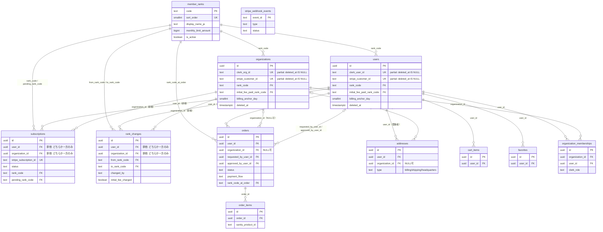

# DBスキーマ再設計（v2）

## 位置づけ

`supabase/migrations/` に積み上がった現行スキーマを、Clerk（個人 = User / 法人 = Organization）× Stripe（初期費用・月額・都度課金）という前提に対してレビューした結果、以下の指摘が出た。本ドキュメントはその是正案を **マイグレーション実行前の設計** としてまとめたもの。マイグレーションファイルは別途、本ドキュメント確定後に段階分割して作成する。

現行スキーマの実体は `supabase/migrations/20260516160953_initial_schema.sql` 以降の全マイグレーション（2026-08-12 時点、develop HEAD `c866670` まで反映済み）。

各テーブル・各カラム・各リレーションシップには「なぜ必要か」を明記する。既存スキーマからそのまま引き継いだ部分（変更なし）についても理由を省略しない。

## 指摘事項との対応表（トレーサビリティ）

| #         | レビューでの指摘                                                                                        | 本設計での対応                                                                                                                                                                                      |
| --------- | ------------------------------------------------------------------------------------------------------- | --------------------------------------------------------------------------------------------------------------------------------------------------------------------------------------------------- |
| 1         | `users`/`organizations` で Stripe 関連カラムの制約が非対称（`UNIQUE`の有無）                            | Stripeサブスクリプション状態を `subscriptions` テーブルに正規化して分離。残る `stripe_customer_id` は両テーブルとも部分UNIQUEに統一（→指摘3とセットで解消）                                         |
| 2         | Webhookのべき等性を担保するテーブルが無い                                                               | `stripe_webhook_events` を新設。`event.id` を主キーで先着1件のみ受理する                                                                                                                            |
| 3         | `deleted_at` と `UNIQUE` の組み合わせで論理削除後の再登録が破綻する                                     | 該当カラムをすべて `WHERE deleted_at IS NULL` の部分UNIQUEインデックスに変更                                                                                                                        |
| 4         | 個人/法人で月次期間の起点（`billing_anchor_day`）の持ち方が非対称                                       | `users` にも `billing_anchor_day` を追加し、両テーブルで同じ方法により期間を算出する                                                                                                                |
| 5         | 住所スキーマが `addresses` と `organizations` 直書きカラムの2箇所に重複                                 | 組織の本店所在地も `addresses`（`type='headquarters'`）に統合し、`organizations` から住所カラムを削除                                                                                               |
| 6         | ENUM と TEXT+CHECK が場当たり的に混在。`member_rank` はENUM値追加のトランザクション制約で運用負債化済み | `member_rank` は参照テーブル `member_ranks` に変更（行データ化）。`order_status`/`order_payment_flow`/`address_type` はTEXT+CHECKに統一し、`approval_status`/`clerk_role`（既にTEXT+CHECK）と揃える |
| 7         | サブスクリプション状態が「今の値」のみで変更履歴を追えない                                              | `rank_changes`（追記専用の履歴テーブル）を新設。`subscriptions` は現在値のミラー、`rank_changes` が来歴を持つ、という役割分担にする                                                                 |
| 8（軽微） | `updated_at` トリガーの有無がテーブルによってバラバラ                                                   | 全テーブルに統一（`favorites`のみ性質上不要と判断し明記）                                                                                                                                           |
| 9（軽微） | `sanity_product_id` の外部整合性チェックが無い                                                          | 本設計のスコープ外として維持（Sanityは別システムであり、DB側でのFK参照は不可能。将来的に整合性チェックバッチを設けることを課題として明記するに留める）                                              |

---

## 設計原則

1. **Stripeは決済の正、Supabaseは参照用ミラー。** Webhook受信時にStripeオブジェクトの状態をそのまま複写する。Supabase側で決済状態を独自に推測・計算しない。
2. **「今の状態」と「来歴」を別テーブルに分離する。** `users`/`organizations`/`subscriptions` は現在値のみを持つ（上書き型）。変更の経緯が必要なものは追記専用の履歴テーブル（`rank_changes`）に外出しする。
3. **個人（User）と法人（Organization）は同じ概念を同じ形で表現する。** 課金・ランク・住所まわりのカラム構成を非対称にしない。共通化できるものは共通テーブルへ、できないものは同じ命名・同じ制約パターンで両テーブルに持つ。
4. **頻繁に値が増減する分類値はENUMにしない。** Postgres ENUMへの値追加は同一トランザクション内で使えない等の制約があり、実際に7ランク移行時（`20260720084006`/`20260720084116`）で運用負債になった。順序を持つ分類（ランク）は行データの参照テーブル、それ以外の状態値はTEXT+CHECKに統一する。
5. **論理削除するテーブルの一意制約は必ず部分インデックスにする。** 物理削除しない設計を選ぶ以上、`deleted_at IS NULL` を条件に含めない一意制約は原則禁止とする。
6. **決済のべき等性はDBで担保する。** アプリケーションコードの実装依存にせず、Webhookイベントの受理可否をDBの一意制約で判定する。

---

## ER概要



`stripe_webhook_events` は他テーブルと関連を持たない独立ログのため、上図では単独エンティティとして扱う（Stripeの `event.id` をそのまま主キーにする）。

`subscriptions` と `rank_changes` は「所有者が `users` か `organizations` のどちらか一方」という排他的関連（exclusive arrow）を、`owner_type`+`owner_id` のポリモーフィック関連ではなく **2本のnullable FKカラム + CHECK制約** で表現する。理由は、Postgresのポリモーフィック関連（`owner_type TEXT` + `owner_id UUID`）はFK制約による参照整合性チェックができず、存在しないIDを指しても検知できないため。2本のFKカラムなら通常のFK制約がそのまま効く。

### 各リレーションシップがなぜ必要か

| リレーションシップ                                                 | なぜ必要か                                                                                                                                           |
| ------------------------------------------------------------------ | ---------------------------------------------------------------------------------------------------------------------------------------------------- |
| `member_ranks` → `users`/`organizations`（`rank_code`）            | 商品カタログの閲覧可否・月次仕入れ上限を、リクエストの都度「今のランクは何か」で判定するため。FKにすることで存在しないランクコードが紛れ込むのを防ぐ |
| `member_ranks` → `subscriptions`/`rank_changes`                    | Stripe側の契約ランクとDB側のランク定義がズレないよう、同じマスタを参照させるため                                                                     |
| `member_ranks` → `orders`（`rank_code_at_order`）                  | 注文時点のランクを固定するため（後述の`orders`セクション参照）。存在しないランクコードを注文に残さないようFKにする                                   |
| `users`/`organizations` → `subscriptions`（排他）                  | 1つのStripeサブスクリプションは必ず個人か法人のどちらか一方に属するため。排他制約により「両方に属する」「どちらにも属さない」不正な行を防ぐ          |
| `users`/`organizations` → `rank_changes`（排他）                   | ランク変更は必ず個人か法人どちらかの出来事であるため。理由は`subscriptions`と同じ                                                                    |
| `users` → `addresses`（`user_id`、必須）                           | どんな住所も「誰が登録したか」が必ず存在するため（本人の配送先でも、組織の共有住所帳でも、実際に入力した担当者がいる）                               |
| `organizations` → `addresses`（`organization_id`、任意）           | 組織の共有住所帳（本店所在地・配送先・請求先）かどうかを判定するため。個人住所では`NULL`のまま                                                       |
| `users` → `orders`（`user_id`）                                    | 注文は必ず特定のClerkアカウントに紐づく必要があるため（組織注文でも「システム上、誰の操作として記録されるか」の起点）                                |
| `organizations` → `orders`（`organization_id`、任意）              | 法人注文かどうかを判定し、月次上限の集計・住所選択のスコープ・承認フローの要否を分岐させるため                                                       |
| `users` → `orders`（`requested_by_user_id`/`approved_by_user_id`） | 組織注文で「誰が発注し、誰が承認したか」を別々に記録しないと、承認フローの監査（FR-018相当）が成立しないため                                         |
| `orders` → `order_items`                                           | 1注文に複数商品が含まれるため（商品ごとに数量・価格・要相談フラグが異なる）                                                                          |
| `users` → `cart_items`/`favorites`                                 | どちらも「特定のユーザーが選んだ商品」を表すため、ユーザーへの従属が必須                                                                             |
| `users`/`organizations` ↔ `organization_memberships`               | ユーザーと組織は多対多（1ユーザーが複数組織に所属しうる）であり、中間テーブル無しでは表現できないため                                                |

---

## テーブル定義

### `member_ranks`（新設・参照テーブル）

**このテーブルが必要な理由**: 会員ランクは「順序を持ち、かつ将来も増減しうる分類」である。Postgres ENUMで表現すると、値の追加が同一トランザクション内で使えない制約により運用が煩雑になる（実際に7ランク移行で2つのマイグレーションに分割する羽目になった実績がある）。行データにすることで、ランクの追加・改称・販売終了を通常のINSERT/UPDATEで行えるようにする。`member_rank` ENUMを置き換える。

| カラム                        | 型          | 制約                   | なぜ必要か                                                                                                                                                                          |
| ----------------------------- | ----------- | ---------------------- | ----------------------------------------------------------------------------------------------------------------------------------------------------------------------------------- |
| `code`                        | TEXT        | PK                     | `starter`/`basic`/`standard`/`pro`/`advanced`/`premium`/`enterprise`。他テーブルから安定して参照できる識別子として、意味のある文字列をそのままキーにする                            |
| `sort_order`                  | SMALLINT    | NOT NULL, UNIQUE       | ドメイン層の`MemberRank.isHigherThan()`等、ランクの上下比較を行う処理があるため、ENUMの宣言順に暗黙依存せず明示的な序列をDBで持つ                                                   |
| `display_name_ja`             | TEXT        | NOT NULL               | 画面表示名をコードにハードコードすると、名称変更のたびにデプロイが必要になるため                                                                                                    |
| `monthly_limit_amount`        | BIGINT      | NULL可                 | 月間仕入れ上限はランクごとの中核的な業務ルールであり、都度アプリケーションコードの定数を書き換えるより、DBを正として一箇所で管理する方が変更に強い。NULL = 無制限（enterprise想定） |
| `stripe_monthly_price_id`     | TEXT        | NULL可                 | ランクとStripe Priceの対応をコード側にハードコードすると、Stripe側でPriceを作り直すたびにデプロイが必要になるため。¥0プランはNULL                                                   |
| `stripe_initial_fee_price_id` | TEXT        | NULL可                 | 初期費用も同様の理由でDB管理する                                                                                                                                                    |
| `is_active`                   | BOOLEAN     | NOT NULL DEFAULT true  | 新規販売を停止したランクがあっても、過去の注文・履歴が参照しているため行を削除できない。削除の代わりに販売可否を切り替えるフラグが必要                                              |
| `created_at`                  | TIMESTAMPTZ | NOT NULL DEFAULT NOW() | いつ追加されたランクかの監査証跡                                                                                                                                                    |
| `updated_at`                  | TIMESTAMPTZ | NOT NULL DEFAULT NOW() | 価格・上限額等の改定日時を追跡するため                                                                                                                                              |

金額そのものの正はStripeダッシュボード（Price）とする。`monthly_limit_amount`のような業務ロジック固有の値のみDBを正とする。

---

### `users`（変更）

**このテーブルが必要な理由**: 個人会員（Clerkの個人User）を表す集約ルート。認証はClerkが正だが、Clerkには持たせられない業務データ（ランク・月次上限・注文履歴との関連等）をSupabase側で保持する必要がある。

| カラム                       | 型          | 制約                                                     | なぜ必要か                                                                                                                                                                                                                                                                                                  |
| ---------------------------- | ----------- | -------------------------------------------------------- | ----------------------------------------------------------------------------------------------------------------------------------------------------------------------------------------------------------------------------------------------------------------------------------------------------------- |
| `id`                         | UUID        | PK                                                       | Clerkの`user_xxx`形式のIDを直接主キーにせず、独立したサロゲートキーを持つことで、認証基盤（Clerk）とドメインモデルを疎結合に保つ                                                                                                                                                                            |
| `clerk_user_id`              | TEXT        | NOT NULL、**部分UNIQUE** `WHERE deleted_at IS NULL`      | Clerkとの紐付けキー。RLSの`get_current_user_id()`がJWTの`sub`クレームからこの列を引いて本人確認するため必須。部分UNIQUEにする理由＝退会（論理削除）後に同じClerkアカウントで再登録すると通常のUNIQUEでは衝突するため（指摘3）                                                                               |
| `stripe_customer_id`         | TEXT        | NULL可、**部分UNIQUE** `WHERE deleted_at IS NULL`        | Checkout Session作成・Invoice発行時にどのStripe Customerに紐づけるかを判定するために必須。部分UNIQUEの理由は`clerk_user_id`と同じ                                                                                                                                                                           |
| ~~`stripe_subscription_id`~~ | —           | 削除                                                     | サブスクリプションは「現在値＋来歴」を持つ独立した概念であり、`subscriptions`テーブルへ切り出す（指摘7）。`users`に直書きすると解約後の再契約で上書きされ、過去の契約情報が失われる                                                                                                                         |
| `email`                      | TEXT        | NOT NULL                                                 | 注文確認・出荷通知等のトランザクションメール送信先として必須                                                                                                                                                                                                                                                |
| `first_name` / `last_name`   | TEXT        | NOT NULL DEFAULT ''                                      | 配送先の宛名候補、請求書・伝票への記載に必要な基本プロフィール                                                                                                                                                                                                                                              |
| `phone_number`               | TEXT        | NOT NULL DEFAULT ''                                      | 配送業者からの連絡先として、住所ごとの`addresses.phone_number`とは別にアカウントレベルの連絡先が必要（本人確認・緊急連絡用途）                                                                                                                                                                              |
| `rank_code`                  | TEXT        | NOT NULL, FK → `member_ranks(code)`, DEFAULT `'starter'` | 商品カタログの閲覧可否・チェックアウト可否・月次上限計算は、リクエストのたびに高頻度で評価される。`subscriptions`/`rank_changes`をJOINせず1行から即座に判定できるよう、意図的に非正規化したキャッシュを持つ。更新は必ず`rank_changes`へのINSERTと同一トランザクションで行い、キャッシュと履歴の不整合を防ぐ |
| `billing_anchor_day`         | SMALLINT    | NULL可, CHECK `BETWEEN 1 AND 28`                         | 月次仕入れ上限は「暦月」ではなく契約の起算日を基準に集計するため、起点日をどこかに持つ必要がある。旧設計では`organizations`にしかなく個人側は`subscribed_at`頼みで非対称だったため追加（指摘4）                                                                                                             |
| `initial_fee_paid_rank_code` | TEXT        | NULL可, FK → `member_ranks(code)`                        | アップグレード時に初期費用を二重課金しないための判定に必要。「どのランクまで初期費用を払い済みか」を都度Stripeの請求履歴から調べるのはコストが高いため、キャッシュとして持つ                                                                                                                                |
| ~~`subscribed_at`~~          | —           | 削除                                                     | `rank_changes`の最古行（`from_rank_code IS NULL`の行）から導出可能なため、同じ情報を2箇所に持たない                                                                                                                                                                                                         |
| `onboarding_completed`       | BOOLEAN     | NOT NULL DEFAULT false                                   | ランク選択等のオンボーディングが未完了のユーザーをmiddlewareでゲートし、完了させるまでカタログ等の主要機能に到達させないために必要                                                                                                                                                                          |
| `profile_completed_at`       | TIMESTAMPTZ | NULL可                                                   | 氏名・電話番号の入力完了時刻。現状どの処理からも参照されないが、将来「未入力の既存会員」を遡及対応する際の判定に使う設計として残す（`specs/005-b2b-organization/data-model.md`のR9参照）                                                                                                                    |
| `deleted_at`                 | TIMESTAMPTZ | NULL可                                                   | 退会を物理削除にすると、その会員の過去の注文・支払い履歴（`orders`等）まで参照不能になり法定保存義務・会計監査に支障が出るため、論理削除にする                                                                                                                                                              |
| `created_at` / `updated_at`  | TIMESTAMPTZ | NOT NULL DEFAULT NOW()                                   | 作成・更新の監査証跡。`updated_at`はトリガーで自動更新                                                                                                                                                                                                                                                      |

`terms_agreed_at`/`terms_version`/`can_invite`/`invite_limit` は既存マイグレーションで削除済み（本設計でも据え置き）。

---

### `organizations`（変更）

**このテーブルが必要な理由**: 法人会員（Clerkの組織）を表す集約ルート。`users`と対称的な責務（ランク管理・月次期間算出・Stripe連携）を組織単位で持つ。個人のuserテーブルと分けているのは、法人は複数ユーザー（`organization_memberships`）が1つの契約・1つの月次上限を共有する点が個人と本質的に異なるため。

| カラム                                                                                        | 型          | 制約                                                     | なぜ必要か                                                                                                                                                                                        |
| --------------------------------------------------------------------------------------------- | ----------- | -------------------------------------------------------- | ------------------------------------------------------------------------------------------------------------------------------------------------------------------------------------------------- |
| `id`                                                                                          | UUID        | PK                                                       | `users`と同じ理由でサロゲートキーとする                                                                                                                                                           |
| `clerk_org_id`                                                                                | TEXT        | NOT NULL、**部分UNIQUE** `WHERE deleted_at IS NULL`      | Clerk Organizationとの紐付けキー。RLSの`get_current_org_id()`がJWTの`org_id`クレームから引く。部分UNIQUEの理由は`users`と同じ（指摘3）                                                            |
| `name`                                                                                        | TEXT        | NOT NULL                                                 | 請求書・見積書に記載する正式な法人名として必須                                                                                                                                                    |
| `representative_name`                                                                         | TEXT        | NOT NULL                                                 | 適格請求書等の書類に代表者名の記載が必要になる場合があるため                                                                                                                                      |
| `phone_number`                                                                                | TEXT        | NOT NULL                                                 | 配送・請求に関する組織代表窓口としての連絡先                                                                                                                                                      |
| ~~`postal_code`~~ / ~~`prefecture`~~ / ~~`city`~~ / ~~`address_line1`~~ / ~~`address_line2`~~ | —           | 削除                                                     | `addresses`（配送先・請求先の複数登録を前提にした住所スキーマ）と全く同じ列を`organizations`に複製していたため、同じ情報の二重管理をやめて`addresses`（`type='headquarters'`）に統合する（指摘5） |
| `invoice_registration_number`                                                                 | TEXT        | NOT NULL, CHECK `^T\d{13}$`                              | インボイス制度（適格請求書等保存方式）で、法人顧客への請求書に記載が法定で求められる登録番号のため。フォーマットのCHECKは入力ミスの早期検知が目的                                                 |
| `onboarding_completed`                                                                        | BOOLEAN     | NOT NULL DEFAULT false                                   | `users`と同じ理由。組織作成とランク選択が別ステップのため、`users.onboarding_completed`とは別に組織側でも完了判定が必要                                                                           |
| `rank_code`                                                                                   | TEXT        | NOT NULL, FK → `member_ranks(code)`, DEFAULT `'starter'` | `users.rank_code`と同じ理由（高頻度に評価される認可判定のための非正規化キャッシュ）。命名も統一する                                                                                               |
| `billing_anchor_day`                                                                          | SMALLINT    | NULL可, CHECK `BETWEEN 1 AND 28`                         | `users`と同じ理由（月次期間の起点）。元々このテーブルにしかなかった非対称を`users`側に追加することで解消した（指摘4）                                                                             |
| ~~`pending_rank`~~                                                                            | —           | 削除                                                     | ダウングレード予約は`subscriptions.pending_rank_code`（現在値）と`rank_changes`（実行後の履歴）で表現するため、独立カラムとして持たない                                                           |
| `stripe_customer_id`                                                                          | TEXT        | NULL可、**部分UNIQUE** `WHERE deleted_at IS NULL`        | `users.stripe_customer_id`と同じ理由。旧設計ではUNIQUE制約が無く`users`と非対称だったため揃える（指摘1・3）                                                                                       |
| ~~`stripe_subscription_id`~~ / ~~`stripe_subscription_schedule_id`~~                          | —           | 削除                                                     | `subscriptions`テーブルへ移動（指摘7と同じ理由）                                                                                                                                                  |
| `initial_fee_paid_rank_code`                                                                  | TEXT        | NULL可, FK → `member_ranks(code)`                        | `users`と同じ理由。命名を統一（旧`initial_fee_paid_rank`）                                                                                                                                        |
| `deleted_at`                                                                                  | TIMESTAMPTZ | NULL可                                                   | 組織クローズ（唯一の管理者退会時等）を論理削除で表現し、過去の法人注文・請求履歴を参照可能なまま残すため                                                                                          |
| `created_at` / `updated_at`                                                                   | TIMESTAMPTZ | NOT NULL DEFAULT NOW()                                   | `updated_at`は旧設計に無く、名称・住所等の変更日時を追跡できなかったため新設（指摘8）                                                                                                             |

---

### `subscriptions`（新設）

**このテーブルが必要な理由**: Stripe Subscriptionオブジェクトの現在値ミラー。旧設計では`stripe_subscription_id`等が`users`/`organizations`に直書きされ、①UNIQUE制約の有無が非対称、②解約・再契約のたびに上書きされ来歴が失われる、という2つの問題があった（指摘1・7）。専用テーブルに切り出すことで、個人・法人どちらのサブスクリプションも同じ形で扱える。

| カラム                                        | 型          | 制約                                                                                                                    | なぜ必要か                                                                                                                                       |
| --------------------------------------------- | ----------- | ----------------------------------------------------------------------------------------------------------------------- | ------------------------------------------------------------------------------------------------------------------------------------------------ |
| `id`                                          | UUID        | PK                                                                                                                      | サロゲートキー                                                                                                                                   |
| `user_id`                                     | UUID        | NULL可, FK → `users(id)`                                                                                                | 個人サブスクリプションの場合のみセット。FKにすることで存在しないユーザーへの契約という不整合を防ぐ                                               |
| `organization_id`                             | UUID        | NULL可, FK → `organizations(id)`                                                                                        | 法人サブスクリプションの場合のみセット。理由は`user_id`と同じ                                                                                    |
| （行制約）                                    |             | CHECK `num_nonnulls(user_id, organization_id) = 1`                                                                      | 「所有者不明」または「個人と法人の両方に属する」という業務上ありえない行を、アプリケーションコードに頼らずDB自身が拒否できるようにするため       |
| `stripe_customer_id`                          | TEXT        | NOT NULL                                                                                                                | Webhookで受信した`customer.id`と突合し、どのStripe顧客の契約かを特定するために必須                                                               |
| `stripe_subscription_id`                      | TEXT        | NOT NULL, UNIQUE                                                                                                        | Stripe側の1つのSubscriptionオブジェクトが、DB側で複数行に分裂しない（二重登録されない）ことを保証するため                                        |
| `stripe_subscription_schedule_id`             | TEXT        | NULL可                                                                                                                  | Stripeではダウングレード予約は「Subscription Schedule」という別オブジェクトで管理される。この参照を保持しないと予約の実行・取消操作ができない    |
| `status`                                      | TEXT        | NOT NULL, CHECK IN (`'trialing'`,`'active'`,`'past_due'`,`'unpaid'`,`'canceled'`,`'incomplete'`,`'incomplete_expired'`) | 支払い遅延（`past_due`）や失敗（`unpaid`）に応じて機能制限・注意喚起の表示を出し分ける必要があるため。Stripeの値をそのまま複写し独自解釈を避ける |
| `rank_code`                                   | TEXT        | NOT NULL, FK → `member_ranks(code)`                                                                                     | 現在契約中のランク。`users`/`organizations`の`rank_code`キャッシュを更新する際の正データ元になる                                                 |
| `pending_rank_code`                           | TEXT        | NULL可, FK → `member_ranks(code)`                                                                                       | ダウングレード予約中の会員に「いつ何に変わるか」をマイページで見せるために必要。旧`organizations.pending_rank`から移動                           |
| `current_period_start` / `current_period_end` | TIMESTAMPTZ | NOT NULL                                                                                                                | 月次仕入れ上限の集計期間・次回請求日の表示に必要                                                                                                 |
| `cancel_at_period_end`                        | BOOLEAN     | NOT NULL DEFAULT false                                                                                                  | 「今期限りで解約予定」の会員をUIで案内し、引き止め導線を出す等の判断に必要                                                                       |
| `canceled_at`                                 | TIMESTAMPTZ | NULL可                                                                                                                  | 実際に解約が確定した日時。予約（`cancel_at_period_end`）と確定を区別するために別カラムが必要                                                     |
| `created_at` / `updated_at`                   | TIMESTAMPTZ | NOT NULL DEFAULT NOW()                                                                                                  | 監査証跡                                                                                                                                         |

**部分UNIQUEインデックス**（所有者ごとに解約済み以外は1件まで。解約後の再契約で新しい行を作れるよう、解約済み行は残したまま除外する）:

```
CREATE UNIQUE INDEX ON subscriptions(user_id) WHERE user_id IS NOT NULL AND status <> 'canceled';
CREATE UNIQUE INDEX ON subscriptions(organization_id) WHERE organization_id IS NOT NULL AND status <> 'canceled';
```

このインデックスが必要な理由: 1つの所有者が同時に2つの有効なサブスクリプションを持つ状態は業務上ありえない（Stripe側でも1顧客につき運用は1サブスクリプションを想定）。解約済み行を対象外にすることで、過去の契約履歴を消さずに「乗り換え」を表現できる。

---

### `rank_changes`（新設・追記専用）

**このテーブルが必要な理由**: 旧設計では`rank`（現在値）しか持たず、「いつ・誰の操作で・どのランクからどのランクに変わったか」を追跡できなかった（指摘7）。カスタマーサポート対応（「いつアップグレードしましたか」）や返金判断（「初期費用は既に払っているか」）に必須の情報を、上書きされない形で残す。**UPDATE/DELETEを行わない**（訂正が必要な場合も打ち消し行を追加する運用とする＝会計伝票の考え方と同じ）。

| カラム                   | 型          | 制約                                                 | なぜ必要か                                                                                                                                                                        |
| ------------------------ | ----------- | ---------------------------------------------------- | --------------------------------------------------------------------------------------------------------------------------------------------------------------------------------- |
| `id`                     | UUID        | PK                                                   | サロゲートキー                                                                                                                                                                    |
| `user_id`                | UUID        | NULL可, FK → `users(id)`                             | 個人のランク変更の場合のみセット                                                                                                                                                  |
| `organization_id`        | UUID        | NULL可, FK → `organizations(id)`                     | 法人のランク変更の場合のみセット                                                                                                                                                  |
| （行制約）               |             | CHECK `num_nonnulls(user_id, organization_id) = 1`   | `subscriptions`と同じ理由（排他制約）                                                                                                                                             |
| `from_rank_code`         | TEXT        | NULL可, FK → `member_ranks(code)`                    | 変更前のランクを記録しないと「何から何に変わったか」という遷移そのものが復元できない。初回契約時は前段が無いためNULL                                                              |
| `to_rank_code`           | TEXT        | NOT NULL, FK → `member_ranks(code)`                  | 変更後のランク。この列が無いと変更履歴として成立しない                                                                                                                            |
| `changed_by`             | TEXT        | NOT NULL, CHECK IN (`'member'`,`'admin'`,`'system'`) | 会員本人の操作か、運営による強制変更か、Webhookによる自動反映かを区別しないと、不正操作や誤課金の切り分け調査ができない                                                           |
| `initial_fee_charged`    | BOOLEAN     | NOT NULL DEFAULT false                               | このランク変更で初期費用が実際に課金されたかを記録することで、`users.initial_fee_paid_rank_code`キャッシュの正しさを事後検証できる                                                |
| `stripe_subscription_id` | TEXT        | NULL可                                               | どのStripeイベント（サブスクリプション更新）に起因する変更かを追跡し、障害調査時にStripeダッシュボードと突合できるようにする。`subscriptions`側は行を使い回すためFK制約は張らない |
| `reason`                 | TEXT        | NULL可                                               | 運営が手動でランクを変更した場合、その理由を残さないとサポート対応の説明責任を果たせない                                                                                          |
| `effective_at`           | TIMESTAMPTZ | NOT NULL DEFAULT NOW()                               | 変更が実際に有効になった日時（Stripeの請求サイクルに合わせて未来日付になることもある）                                                                                            |
| `created_at`             | TIMESTAMPTZ | NOT NULL DEFAULT NOW()                               | この行が記録された日時。`effective_at`とはWebhook遅延等でズレうるため別カラムにする                                                                                               |

`users.rank_code`/`organizations.rank_code`の更新は、必ず対応する`rank_changes`行のINSERTと同一トランザクションで行う（キャッシュと履歴の不整合を防ぐ）。

---

### `stripe_webhook_events`（新設）

**このテーブルが必要な理由**: Stripeは同一イベントを複数回配信することがある（公式に保証された仕様）。旧設計にはイベントの処理済み判定を行う仕組みがDBに一切無く、各use case（`markCheckoutOrderAsPaid`等）の実装に冪等性の担保が委ねられていた（指摘2）。DB側の一意制約で機械的に二重処理を防ぐ。

| カラム         | 型          | 制約                                                                                 | なぜ必要か                                                                                                                           |
| -------------- | ----------- | ------------------------------------------------------------------------------------ | ------------------------------------------------------------------------------------------------------------------------------------ |
| `event_id`     | TEXT        | PK                                                                                   | Stripeの`event.id`をそのまま主キーにすることで、`INSERT ... ON CONFLICT DO NOTHING`という1回のクエリだけで重複配信の排除判定ができる |
| `type`         | TEXT        | NOT NULL                                                                             | どの種類のイベントか（例: `checkout.session.completed`）が分からないと、ログの絞り込み・監視ダッシュボードでの集計ができない         |
| `status`       | TEXT        | NOT NULL, CHECK IN (`'processing'`,`'processed'`,`'failed'`), DEFAULT `'processing'` | 処理中・成功・失敗を区別し、失敗したイベントだけを再試行対象として抽出できるようにするため                                           |
| `payload`      | JSONB       | NOT NULL                                                                             | 障害調査時にStripe側の再送に頼らず、受信した生データをローカルで再現・再処理できるようにするため                                     |
| `error`        | TEXT        | NULL可                                                                               | `status='failed'`時に、次に見る人（運営・開発者）が原因を即座に把握できるようにするため                                              |
| `received_at`  | TIMESTAMPTZ | NOT NULL DEFAULT NOW()                                                               | Webhookの受信遅延を監視するため                                                                                                      |
| `processed_at` | TIMESTAMPTZ | NULL可                                                                               | 受信から処理完了までのリードタイムを計測し、性能劣化を検知するため                                                                   |

**処理パターン**: `INSERT ... ON CONFLICT (event_id) DO NOTHING RETURNING event_id`。行が返らなければ「処理済みまたは処理中」と判定してその場でスキップする。処理完了後に`status`/`processed_at`をUPDATE。既存の各use case（`markCheckoutOrderAsPaid`等）の冪等性実装に加えて、DB層でも二重処理を機械的に防ぐ。

---

### `addresses`（変更）

**このテーブルが必要な理由**: 配送先・請求先（および法人の本店所在地）という「複数登録されうる住所」を一元管理する。注文時点の住所は`orders`にスナップショットとして複製するため、このテーブル自体は「現在登録されている住所帳」という役割に限定される。

| カラム                                                  | 型          | 制約                                                           | なぜ必要か                                                                                                                                                                                                                                                     |
| ------------------------------------------------------- | ----------- | -------------------------------------------------------------- | -------------------------------------------------------------------------------------------------------------------------------------------------------------------------------------------------------------------------------------------------------------- |
| `id`                                                    | UUID        | PK                                                             | サロゲートキー                                                                                                                                                                                                                                                 |
| `user_id`                                               | UUID        | NOT NULL, FK → `users(id)`                                     | どんな住所も「誰が登録したか」を必ず記録する。組織の共有住所帳でも、実際に入力した担当者を特定できないと退会時のデータクリーンアップ対象が判断できない（`headquarters`行でも同様）                                                                             |
| `organization_id`                                       | UUID        | NULL可, FK → `organizations(id)`                               | 個人住所か、組織の共有住所帳かを判定するために必要。組織スコープのRLSポリシーもこの列で分岐する                                                                                                                                                                |
| `type`                                                  | TEXT        | NOT NULL, CHECK IN (`'billing'`,`'shipping'`,`'headquarters'`) | 配送先・請求先・本店所在地のどれかを区別しないと、注文時にどの住所を提示すればよいか決められない。旧`address_type` ENUMをTEXT+CHECKに変更し、**`'headquarters'`を追加**したことで、`organizations`直書きだった住所カラムをこのテーブルに統合できる（指摘5・6） |
| `is_default`                                            | BOOLEAN     | NOT NULL DEFAULT false                                         | 複数登録された住所の中から、チェックアウト画面でデフォルト選択するUI要件のため                                                                                                                                                                                 |
| `recipient_last_name` / `recipient_first_name`          | TEXT        | NOT NULL                                                       | 配送先の宛名は契約者本人と異なることがある（代理受取・別部署宛て等）ため、`users`/`organizations`の氏名とは別に持つ必要がある。`headquarters`行には`organizations.representative_name`と同じ値を入れる                                                         |
| `postal_code` / `prefecture` / `city` / `address_line1` | TEXT        | NOT NULL                                                       | 配送業者への送り状作成・請求書送付に必須の住所要素                                                                                                                                                                                                             |
| `address_line2`                                         | TEXT        | NULL可                                                         | 建物名・部屋番号等、物件によっては存在しない住所要素のため任意項目にする                                                                                                                                                                                       |
| `phone_number`                                          | TEXT        | NOT NULL                                                       | 配送業者が不在時・住所不明時に連絡する手段として、配送先ごとに必須                                                                                                                                                                                             |
| `created_at` / `updated_at`                             | TIMESTAMPTZ | NOT NULL DEFAULT NOW()                                         | 監査証跡                                                                                                                                                                                                                                                       |

**部分UNIQUEインデックス（新設）**: `CREATE UNIQUE INDEX ON addresses(organization_id) WHERE type = 'headquarters'`。1組織につき本店所在地は法的に1件のみ存在するという業務ルールをDB制約として表現するために必要。

---

### `organization_memberships`（変更）

**このテーブルが必要な理由**: `users`と`organizations`は多対多（1ユーザーが複数組織に所属しうる）の関係であり、中間テーブル無しでは表現できない。ClerkのOrganizationMembershipをWebhookでミラーリングし、DB側のRLS判定（`get_current_org_ids()`）の根拠にする。

| カラム            | 型          | 制約                                              | なぜ必要か                                                                              |
| ----------------- | ----------- | ------------------------------------------------- | --------------------------------------------------------------------------------------- |
| `id`              | UUID        | PK                                                | サロゲートキー                                                                          |
| `organization_id` | UUID        | NOT NULL, FK → `organizations(id)`                | どの組織への所属かを特定する本体データ                                                  |
| `user_id`         | UUID        | NOT NULL, FK → `users(id)`                        | どのユーザーの所属かを特定する本体データ                                                |
| `clerk_role`      | TEXT        | NOT NULL, CHECK IN (`'org:admin'`,`'org:member'`) | 注文承認フローで「承認権限があるか」を判定するために必須（`org:admin`のみ承認可能）     |
| `created_at`      | TIMESTAMPTZ | NOT NULL DEFAULT NOW()                            | いつ組織に加入したかの記録                                                              |
| `updated_at`      | TIMESTAMPTZ | NOT NULL DEFAULT NOW()                            | 旧設計に無く、`clerk_role`の昇格・降格がいつ起きたかを追跡できなかったため新設（指摘8） |

制約 `UNIQUE(organization_id, user_id)` は維持。同じユーザーが同じ組織に二重所属する状態を防ぐために必要。

---

### `orders`（変更）

**このテーブルが必要な理由**: 注文の集約ルート。個人・法人、Checkout・Invoiceという異なる支払いフローを、同じ状態遷移（`status`）とテーブルで扱うことで、注文一覧・検索・通知などの横断機能を1つの実装で済ませられる。

| カラム                                                   | 型          | 制約                                                                                                                                                                                                                                   | なぜ必要か                                                                                                                                                                                                                                    |
| -------------------------------------------------------- | ----------- | -------------------------------------------------------------------------------------------------------------------------------------------------------------------------------------------------------------------------------------- | --------------------------------------------------------------------------------------------------------------------------------------------------------------------------------------------------------------------------------------------- |
| `id`                                                     | UUID        | PK                                                                                                                                                                                                                                     | サロゲートキー                                                                                                                                                                                                                                |
| `user_id`                                                | UUID        | NOT NULL, FK → `users(id)`                                                                                                                                                                                                             | 組織注文であっても「システム上、誰の操作として記録されるか」の起点が必要（個人注文では発注者そのもの）                                                                                                                                        |
| `organization_id`                                        | UUID        | NULL可, FK → `organizations(id)`                                                                                                                                                                                                       | 法人注文かどうかを判定し、月次上限の集計スコープ・住所選択のスコープ・承認フローの要否を分岐させるために必要                                                                                                                                  |
| `requested_by_user_id` / `approved_by_user_id`           | UUID        | NULL可, FK → `users(id)`                                                                                                                                                                                                               | 組織注文で「誰が発注し、誰が承認したか」を別々に記録しないと、承認フローの監査（不正発注時の説明責任）が成立しないため                                                                                                                        |
| `payment_flow`                                           | TEXT        | NOT NULL, CHECK IN (`'checkout'`,`'invoice'`)                                                                                                                                                                                          | 即時決済（Checkout）か請求書後払い（Invoice）かによって、その後の状態遷移・Webhookイベントの種類・入金確認の方法が完全に異なるため区別が必須。旧`order_payment_flow` ENUMをTEXT+CHECKに変更（指摘6）                                          |
| `status`                                                 | TEXT        | NOT NULL, CHECK IN (`'pending_approval'`,`'pending_payment'`,`'confirming'`,`'limit_exceeded'`,`'invoice_sent'`,`'paid'`,`'sourcing'`,`'ordered'`,`'preparing'`,`'shipping'`,`'delivered'`,`'cancelled'`), DEFAULT `'pending_payment'` | 注文のライフサイクル全体を1カラムで管理することで、画面表示の出し分け・通知トリガーの判定を単一の値で行えるようにするため。旧`order_status` ENUMをTEXT+CHECKに変更（指摘6）                                                                   |
| `approval_status`                                        | TEXT        | NULL可, CHECK IN (`'auto_approved'`,`'pending_approval'`,`'approved'`,`'rejected'`)                                                                                                                                                    | 法人の承認要否と結果を`status`とは独立して持つ理由＝個人注文と法人注文の状態遷移を1つの`status`に混ぜ込むと分岐が複雑化するため。個人注文はNULLのまま                                                                                         |
| `approved_at`                                            | TIMESTAMPTZ | NULL可                                                                                                                                                                                                                                 | 承認が行われた日時。「承認された」という事実だけでなく、いつ承認されたかがSLA管理・監査に必要                                                                                                                                                 |
| `shipping_address_snapshot` / `billing_address_snapshot` | JSONB       | NOT NULL                                                                                                                                                                                                                               | 発送後に会員が`addresses`側の住所を変更・削除しても、過去注文の記録は注文当時の内容のまま保持する必要があるため（会計・配送トラブル対応上の要件）                                                                                             |
| `rank_code_at_order`                                     | TEXT        | NOT NULL, FK → `member_ranks(code)`                                                                                                                                                                                                    | 月間仕入れ上限はランクごとに異なる。注文後にランクが変わっても過去注文の集計が狂わないよう、注文時点のランクを固定して残す必要がある。`member_ranks`の行は`is_active`で無効化するのみで削除しないため、FKを張っても過去注文の整合性が壊れない |
| `monthly_limit_at_order`                                 | BIGINT      | NOT NULL                                                                                                                                                                                                                               | `rank_code_at_order`と同じ理由。上限額自体もランク改定の影響を受けないようスナップショットする                                                                                                                                                |
| `stripe_checkout_session_id` / `stripe_invoice_id`       | TEXT        | NULL可                                                                                                                                                                                                                                 | Webhook受信時に「どの注文に対するイベントか」を突合するキーとして必要。`payment_flow`により片方のみ埋まる                                                                                                                                     |
| `split_group_id`                                         | UUID        | NULL可                                                                                                                                                                                                                                 | 1回のカートに即時決済商品と要相談商品が混在する場合、Checkout用とInvoice用の2件の`orders`行に分割される。元は同じ会計だったことを結びつけないと、会員への注文内容表示が分裂して見えるため                                                     |
| `created_at` / `updated_at`                              | TIMESTAMPTZ | NOT NULL DEFAULT NOW()                                                                                                                                                                                                                 | 監査証跡                                                                                                                                                                                                                                      |

---

### `order_items`（変更）

**このテーブルが必要な理由**: 1注文は複数商品を含みうるため、`orders`と商品情報の間に多対1の中間エンティティが必要。

| カラム                  | 型          | 制約                        | なぜ必要か                                                                                                                                            |
| ----------------------- | ----------- | --------------------------- | ----------------------------------------------------------------------------------------------------------------------------------------------------- |
| `id`                    | UUID        | PK                          | サロゲートキー                                                                                                                                        |
| `order_id`              | UUID        | NOT NULL, FK → `orders(id)` | どの注文の明細かを特定する本体データ                                                                                                                  |
| `sanity_product_id`     | TEXT        | NOT NULL                    | 商品マスタはSanity CMS側にあり、SupabaseにFK参照できないため、外部システムのIDをそのまま保持する（指摘9のとおりDB側でのFK整合性チェックはスコープ外） |
| `product_name_snapshot` | TEXT        | NOT NULL                    | Sanity側で商品名が変更・削除された後も、過去注文の明細表示が壊れないようにするため                                                                    |
| `unit_price_snapshot`   | BIGINT      | NULL可                      | 価格改定後も過去注文の金額を正しく保持するため。NULL＝要相談商品で注文時点では価格未確定                                                              |
| `quantity`              | INTEGER     | NOT NULL, CHECK `> 0`       | 注文数量。CHECKにより「数量0の注文明細」という無意味な状態をDBレベルで防ぐ                                                                            |
| `is_negotiable`         | BOOLEAN     | NOT NULL DEFAULT false      | 価格未確定の要相談商品かどうかを判定し、Invoiceフローに回すかどうかの分岐に使うため                                                                   |
| `negotiated_unit_price` | BIGINT      | NULL可                      | 運営者が請求書発行時に確定させた単価。要相談商品の最終金額を別カラムに残すことで、当初の見込み額（あれば）と実額を両方追跡できる                      |
| `created_at`            | TIMESTAMPTZ | NOT NULL DEFAULT NOW()      | 明細行の作成日時                                                                                                                                      |
| `updated_at`            | TIMESTAMPTZ | NOT NULL DEFAULT NOW()      | 旧設計に無く、運営による`negotiated_unit_price`確定日時を追跡できなかったため新設（指摘8）                                                            |

---

### `cart_items`（変更なし）

**このテーブルが必要な理由**: 購入前の一時的な商品選択状態を保持する。`orders`/`order_items`と分離しているのは、注文確定前（スナップショット化前）は会員が何度でも自由に変更できる、性質の異なるデータのため。

既存のまま維持。`updated_at`トリガーは既にある。`UNIQUE (user_id, sanity_product_id)`は「同じ商品をカートに2行として重複登録せず、数量を1行に集約する」ために必要。

---

### `favorites`（変更なし・意図的に据え置き）

**このテーブルが必要な理由**: 「今すぐ買う意思」を表す`cart_items`とは異なり、「関心があるので後で見返したい」という記録を残すための別概念。同じテーブルにフラグで持たせず分離しているのは、カートと違って数量や注文への遷移を持たない単純な集合だから。

`updated_at`は追加しない。更新可能なカラムが存在しない（追加・削除のみのテーブル）ため、トリガーを付けても意味を持たない。`UNIQUE (user_id, sanity_product_id)`は`cart_items`と同じ理由（重複登録の防止）。

---

## 廃止されるオブジェクト

| オブジェクト                                                               | 種別   | 理由                                       |
| -------------------------------------------------------------------------- | ------ | ------------------------------------------ |
| `member_rank`                                                              | ENUM型 | `member_ranks`参照テーブルへ置き換え       |
| `order_status`                                                             | ENUM型 | `orders.status` TEXT+CHECKへ置き換え       |
| `order_payment_flow`                                                       | ENUM型 | `orders.payment_flow` TEXT+CHECKへ置き換え |
| `address_type`                                                             | ENUM型 | `addresses.type` TEXT+CHECKへ置き換え      |
| `users.stripe_subscription_id`                                             | カラム | `subscriptions`へ移動                      |
| `users.subscribed_at`                                                      | カラム | `rank_changes`から導出可能なため廃止       |
| `organizations.postal_code`〜`address_line2`                               | カラム | `addresses`（`type='headquarters'`）へ統合 |
| `organizations.pending_rank`                                               | カラム | `subscriptions.pending_rank_code`へ移動    |
| `organizations.stripe_subscription_id` / `stripe_subscription_schedule_id` | カラム | `subscriptions`へ移動                      |

---

## RLSポリシー方針への影響

- `subscriptions` / `rank_changes` / `stripe_webhook_events`：いずれもRLS有効化した上で、参照ポリシーはSELECTのみ（`subscriptions`は本人/同一組織メンバーが自分の契約状況を見られるよう`orders`と同様のポリシーを追加する）。書き込みは全てservice role（Webhookハンドラー）経由に限定し、ユーザー向けINSERT/UPDATE/DELETEポリシーは設けない。`stripe_webhook_events`はユーザーへのSELECT公開もしない（運営者のみ、アプリケーションからは触らない）。
- `member_ranks`：全会員が参照できる必要があるため、`FOR SELECT USING (true)`（マスタデータ）。書き込みは運営者のみ。
- `addresses`：既存の「本人 or 同一組織」ポリシーはそのまま流用できる（`type='headquarters'`の行も`organization_id`が入っているため既存の組織スコープポリシーの対象になる）。

## 移行方針（概要・詳細はマイグレーション作成時に確定）

1. `member_ranks`を作成し、現行7ランク分のマスタ行を投入する。
2. `subscriptions`/`rank_changes`/`stripe_webhook_events`を新設。
3. `users`/`organizations`の既存Stripeカラムから`subscriptions`へバックフィル。既存の`rank`/`initial_fee_paid_rank`を起点に`rank_changes`の初期1行（`from_rank_code = NULL`, `changed_by = 'system'`）を生成する。
4. `orders.status`等のENUM→TEXTは、新カラムを追加→データコピー→旧カラム削除→リネームの手順で無停止移行する（Postgresの`ALTER TYPE`制約を踏まえ、旧ENUM値を都度追加していた現行運用と同じ理由でワンステップ変換は避ける）。
5. `organizations`の住所カラムを`addresses`へバックフィル後に削除する。
6. 最後に部分UNIQUEインデックス群を追加する。

この設計に問題なければ、上記の移行方針をベースに実際のマイグレーションファイル作成に進みます。
