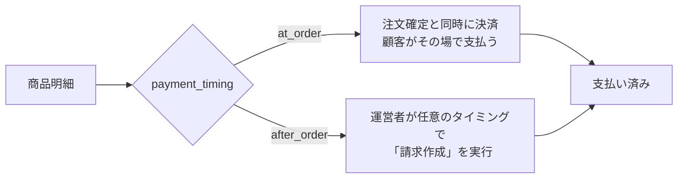
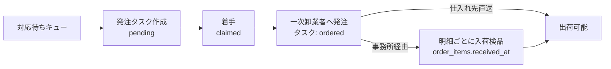
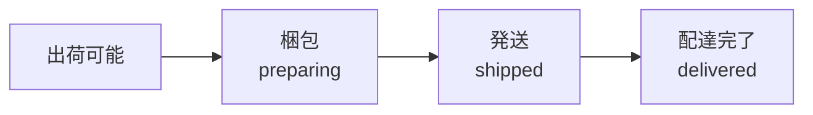

# 注文フロー全体（決済 → 調達 → 配送はそれぞれ独立したフェーズ）

## これは何か（2026-09-13全面改訂: 1枚の巨大な図をやめ、フェーズ分解に変更）

以前この文書には、1つの注文に含まれる複数の商品明細を、決済〜配送まで通しで1枚のシーケンス図に描いたバージョンがあったが、**情報量が多すぎて理解の助けにならなかったため撤回した**。

Shopify・Amazonのような実際のECシステムも、注文の全行程を1つの巨大な状態機械では管理していない。**決済・調達・配送はそれぞれ完全に独立したフェーズとして設計し、フェーズ同士は「イベントが起きたかどうか」という単純な合図だけでつなぐ**（Shopifyでいう`orders/paid`・`fulfillments/create`のようなWebhookイベントによる疎結合と同じ考え方）。1つの商品明細の一生を頭の中で全部つなげて理解する必要はなく、**今どのフェーズの話をしているかだけ意識すればよい**。

本ドキュメントは、この3つのフェーズそれぞれを単体で理解できる小さな図と、フェーズ間をつなぐ「入場条件」だけをまとめる。業務ルールの正（せい）は[[settlement]]・[[procurement]]・[[fulfillment]]の各ドメインドキュメントであり、本ドキュメントと矛盾する場合はそちらが正しい。

## 3つの独立したフェーズ

### フェーズ1: 決済（[[settlement]]の責務）

このフェーズが知っているのは「この明細グループにお金が動いたか」だけ。誰が発注するか、いつ届くかは一切関知しない。

### フェーズ2: 調達（[[procurement]]の責務）

このフェーズが知っているのは「この明細は今、発注してよい状態か」というキューだけ。なぜその状態になったか（先払いだったか後払いだったか）は一切関知しない。

**発注（`ordered`）はタスク単位、入荷（`received_at`）は明細単位（2026-09-19確定）**: 複数の顧客の明細をまとめて1回の電話で発注するのは1つの行為なのでタスク側が持つが、実際に届くタイミングは明細ごとにバラバラになりうる（部分入荷）ため、`received_at`は明細（`order_items`）に個別に記録する。詳細は[[procurement]]参照。

### フェーズ3: 配送（[[fulfillment]]の責務）

このフェーズが知っているのは「この明細は今、発送してよい状態か」というキューだけ。決済がいつ済んだかは一切関知しない。

## 各フェーズに「入る条件」（これだけ覚えればよい。矢印の向きは順番を意味しない）

フェーズ同士の連携は、複雑な連携ロジックではなく、それぞれ1行の条件だけ。**どちらのフェーズが先に始まるかは商品によって変わる**ため、下表は「順番」ではなく「入る条件」として読む。

| フェーズ                 | 入る条件                                                                                                                                                        |
| ------------------------ | --------------------------------------------------------------------------------------------------------------------------------------------------------------- |
| **対応待ちキューに入る** | `payment_timing='at_order'`の明細: 支払い済みになった瞬間（決済が先） `payment_timing='after_order'`の明細: 注文確定と同時（支払いは待たない、調達が先）    |
| **出荷可能になる**       | 事務所経由（`requires_receiving=true`）: `received`になった瞬間 仕入れ先直送（`requires_receiving=false`）: `ordered`になった瞬間（`received`を経由しない） |

これ以外に、フェーズ同士が互いの内部状態を参照するルールは存在しない。

**後払い商品の場合、調達が決済より先に始まることがある**: `payment_timing='after_order'`の商品は注文確定と同時に調達キューに入るため、運営者が「入荷検品のついでに請求作成しよう」のように請求のタイミングを遅らせれば、調達（発注〜入荷）の方が決済より先に進む。これは商品の価格が確定しているかどうかとは無関係で、単に運営者が「請求作成」をいつ実行するかの選択の結果である。同じ運営者が2つのフェーズの操作を続けて行っているだけで、フェーズ自体が互いを知っているわけではない。

**要相談商品（`is_negotiable`）はVer1では扱わない（2026-09-14、[[catalog]]参照）**。価格が事前に分からない商品を扱う場合は、上記よりさらに複雑な設計（価格確定と上限チェックのタイミング調整等）が必要になるため、実際の需要が見えてから改めて設計する。

## この設計のポイント

- **1つの商品明細の一生を、頭の中で全部つなげて追う必要はない**。「今どのフェーズの話をしているか」だけ意識すればよく、フェーズごとの図はどれも単純
- **複数の商品が1つの注文に混在していても、フェーズの数は増えない**。それぞれの明細が、同じ3つのフェーズを、自分のペースで独立に通過するだけ（ある明細が先にフェーズ3まで進んでも、他の明細には一切影響しない）
- **決済フェーズと調達フェーズ、どちらが先に始まるかは商品によって変わる**。先払い商品は決済が先、時価商品は調達（価格交渉）が先になる。フェーズの順番が固定されていないこと自体が、この設計が「決済が終わったら次は調達」という一本道の状態機械ではないことの表れ
- **`orders.status`は、どのフェーズにも属さない「表示用の集計値」**。3フェーズの状態を都度合算して算出するだけで、フェーズの一部として扱わない

## この図に含まれないもの（意図的なスコープ外）

- **返品・返金**: `delivered`到達後に問題が起きた場合の分岐は[[returns]]を参照。旧`archive/order-flow.md`の「原則返金なし」という方針と、新しい返金フロー設計が矛盾している点は未解決
- **運営スタッフの権限チェックの詳細**: `admin-rbac.md`を参照
- **担当割り振りの最適化・発注期限による優先度付け**: 2026-09-13時点で明確な業務要件がないため作らない方針（[[procurement]]参照）

## 参考資料

- [[settlement]]: フェーズ1（決済）の詳細な業務ルール
- [[procurement]]: フェーズ2（調達）の詳細な業務ルール
- [[fulfillment]]: フェーズ3（配送）の詳細な業務ルール
- [[ordering]]: フェーズ1より前（カート確定・法人承認）の業務ルール
- [[returns]]: フェーズ3より後（返品・返金）の業務ルール
- （2026-09-13: 3商品混在の具体例を1枚の巨大なシーケンス図にまとめたバージョンを一度作成したが、複雑すぎたため撤回し、フェーズ分解版に置き換えた）
