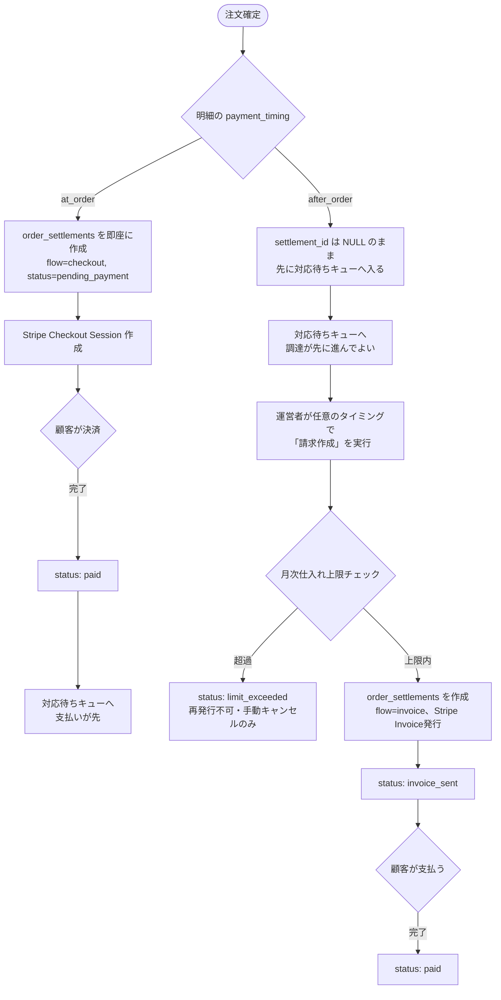
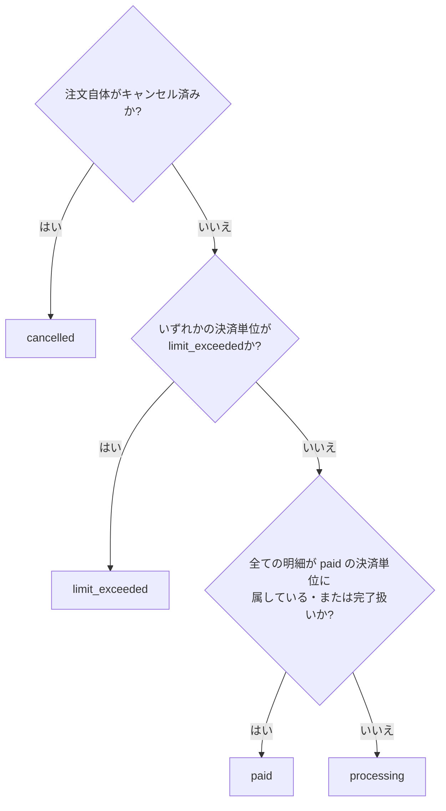

# 決済・精算（Settlement）

## これは何か（2026-09-13新設、2026-09-13改訂で単純化）

このドキュメントは「注文（`orders`）に含まれる商品明細（`order_items`）が、どうやってStripeでの決済に紐づき、`paid`（入金確認済み）に至るか」を定義する。[[ordering]]から**決済・精算に関する部分だけを切り出した**境界づけられたコンテキストであり、従来[[ordering]]が担っていた「チェックアウト分割（`split_group_id`により1回の注文から2件の`orders`を生成する）」という設計を置き換える。

**本ドキュメントは一度「支払いトリガーを商品ごとに何種類も持つ」という設計を検討したが、実装コストに見合わないと判断し撤回した。最終的には[[ordering]]がすでに持っていた`payment_timing`（`at_order`/`after_order`）の2値のみを使う、次の方針に落ち着いている**（経緯は後述「なぜこの設計に変えたか」）。

**要相談商品（`is_negotiable`）はVer1では扱わない（2026-09-14確定、[[catalog]]参照）。** これにより本ドキュメントが扱う全ての明細は、注文確定時点で価格が確定している前提で設計できる。要相談商品固有の複雑さ（価格未確定のまま調達が進み、価格確定後に月次上限を超過することが判明する等）への対応は、Ver2以降で要相談商品を実装する際にあらためて設計する。

**扱うこと**:

- 決済単位（`order_settlements`）による、1つの注文内での支払いタイミング違い（即時／後払い）の表現
- `order_items.settlement_id`を通じた、明細単位での決済状態の追跡
- 決済単位ごとの状態遷移とStripe Webhookによる自動更新
- 月次仕入れ上限チェックの実行タイミング
- `orders.status`（注文全体の表示用ロールアップ値）の算出ルール

**扱わないこと**:

- カートへの商品追加、法人組織の承認フロー、住所スナップショット、注文明細のスナップショット化、`payment_timing`の判定根拠そのものは引き続き[[ordering]]が扱う
- `paid`到達後の商品明細ごとの発注・入荷の進捗（対応待ちキューへの入場条件は本ドキュメントが定義するが、その先の発注業務自体は）[[procurement]]が扱う
- 梱包・分割出荷・配送状況は[[fulfillment]]が扱う
- 返品・返金は[[returns]]が扱う

## なぜこの設計に変えたか

### 経緯1: `orders`を1行のまま保つ（2026-09-13、当初の設計変更）

**旧設計（チェックアウト分割）の問題**: 支払いタイミングが混在するカートは、チェックアウト時に自動的に2件の`orders`に分割し、`split_group_id`で紐付けていた。この設計には次の欠陥があった。

- `shipments.order_id`は単一`orders`へのNOT NULL FKだったため、分割された2件の`orders`にまたがる商品明細は、たとえ入荷タイミングが揃っても**物理的に同じ箱へ同梱できなかった**
- 商品明細ごとの発送状態は明細単位で管理する方針にすでに転換していたにもかかわらず、決済状態だけ`orders`単位のままという不整合があった

**新設計の考え方**: 決済状態を`orders`ではなく`order_items`が参照する子エンティティ（`order_settlements`）に持たせることで、`orders`は常に1回のチェックアウト操作＝1行のまま保つ。Shopifyの`Order`に対する`Fulfillment`（出荷）・`Transaction`（決済操作）の分離と同じ考え方であり、複数配送・複数決済が絡む成熟したECシステムで共通して採用されているパターン。

### 経緯2: 支払いトリガーを増やさず、`at_order`/`after_order`の2値のまま「いつ請求するか」を運営者の判断に委ねる（2026-09-13、当日中の再改訂）

当初、「事務所への入荷時に自動請求する」のような商品ごとの支払いトリガーを複数種類（`at_order`/`on_received`/`manual`等）持たせる設計を検討した。しかし次の理由で撤回した。

- `on_received`のような「特定のイベント発生時に自動で請求書を発行する」仕組みは、発火条件ごとに別々のコード（どのユースケースにフックするか）が必要になり、トリガーの種類が増えるたびに実装が増える
- 発注・入荷・配送はどのみち運営者が手作業で行っている。「請求書を出すタイミング」も運営者の手作業の一部として任せてしまって顧客体験上の差はほとんどない
- 運営者に「選んだ明細に対して請求を作成する」という**汎用操作を1つ**用意すれば、押すタイミングを変えるだけで「入荷直後に請求」「価格交渉後に請求」等、あらゆる後払いパターンを実現できる。将来新しい「後払いの理由」が増えても、運営者が同じボタンを別のタイミングで押すだけで対応でき、**スキーマ変更もコード変更も発生しない**

結果として、商品ごとの支払いタイミング区分は、[[ordering]]がすでに定義していた`payment_timing`（`at_order`/`after_order`の2値）をそのまま使えば十分だと分かった。新しい区分を追加する必要はない。

## 主要な概念・用語

| 用語                                    | 定義                                                                                                                                                                                                      |
| --------------------------------------- | --------------------------------------------------------------------------------------------------------------------------------------------------------------------------------------------------------- |
| **決済単位（Settlement）**              | ある1回の決済操作（1つのStripe Checkout Session、または1つのStripe Invoice）を表す記録。DB上は`order_settlements`の1行                                                                                    |
| **`flow`**                              | 決済単位が`checkout`（顧客が注文確定時にその場で決済）か`invoice`（運営者が任意のタイミングで請求書を発行）かを表す区分                                                                                   |
| **明細の決済紐付け（`settlement_id`）** | `order_items.settlement_id`。ある明細がどの決済単位に属するかを表すFK（NULL可）。`payment_timing='at_order'`の明細は注文確定と同時に、`'after_order'`の明細は運営者が請求を作成した時点で設定される       |
| **請求作成（汎用操作）**                | 運営者が対応待ちの`after_order`明細から任意の組み合わせを選び、1つの`order_settlements`（`flow='invoice'`）を作成・Stripe Invoiceを発行する操作。どんな理由でこのタイミングを選んだかをシステムは問わない |
| **注文ステータスのロールアップ**        | `orders.status`は正のデータではなく、配下の`order_settlements`・`order_items`から都度算出する表示用の値                                                                                                   |

## 業務ルール・不変条件

### 全体の流れ（図解）

`at_order`は「決済が先、対応待ちキューはその後」、`after_order`は「対応待ちキューが先、決済はその後（任意のタイミング）」という順番の違いが、この図の分岐にそのまま表れている。

### 確定しているもの

**決済単位の作成タイミング**

- 注文確定（`place-order`）時点では`orders`を1行、`order_items`を全明細分作成する
- **法人組織の承認待ちフローは2026-09-13廃止**（[[ordering]]参照）。法人会員・個人会員の区別なく、注文確定と同じトランザクションで即座に決済単位の作成へ進む
- `payment_timing='at_order'`の明細: 注文確定（承認不要、または承認済み）と同じトランザクション内で、即座に`order_settlements`（`flow='checkout'`, `status='pending_payment'`）を作成し、Stripe Checkout Sessionを作成する。1つの注文に`at_order`の明細が複数あっても、まとめて1つの決済単位でよい
- `payment_timing='after_order'`の明細: 注文確定時点では**決済単位を一切作らない**。`settlement_id`は`NULL`のまま。この明細は即座に[[procurement]]の対応待ちキューに入る（後述）
- `after_order`の明細に対する決済単位は、運営者が管理画面で「対応待ちの`after_order`明細から任意の組み合わせを選んで請求を作成する」操作を行った時点で初めて作られる（`flow='invoice'`）。このタイミングは運営者の裁量であり、システムは「入荷後でなければならない」「価格交渉後でなければならない」といった制約を課さない
- 1つの注文に対して、`after_order`の請求作成操作は**複数回・任意の回数**行いうる（1つの注文の`after_order`明細を、まとめて1回で請求してもよいし、複数回に分けて請求してもよい）。決済単位の数を2件までに制限する前提は置かない

**決済単位ごとの状態遷移**

- `checkout`決済単位: `pending_payment` →（Stripeの`checkout.session.completed` Webhook）→ `paid`。`paid_at`を設定する
- `invoice`決済単位: 運営者が対象明細を選び請求作成を実行した時点で作成され、同時に月次仕入れ上限チェックを行う。上限超過なら`limit_exceeded`（再発行不可、運営者が手動キャンセルのみ可能）、上限内ならその場でStripe Invoiceを発行し`invoice_sent`に。→（Stripeの`invoice.paid` Webhook）→ `paid`
- **`confirming`という決済単位側の状態は持たない**。価格交渉や請求タイミングを待っている間、対象の明細はまだどの決済単位にも属していない（`settlement_id IS NULL`）だけであり、決済単位自体がまだ存在しないため、待機状態を表す決済単位のステータスは不要
- 決済単位が`paid`になった時点で、その決済単位に紐づく明細が調達側の進捗に応じて先へ進む（`at_order`の明細はここで初めて対応待ちキューに入る。`after_order`の明細はすでにキューに入っているので、単に「支払い済み」という事実が記録されるだけ）

**対応待ちキューへの入場条件（[[procurement]]と対）**

- `payment_timing='at_order'`の明細: 自分の属する決済単位が`paid`になってから対応待ちキューに入る（支払いが先）
- `payment_timing='after_order'`の明細: 注文確定と同時に対応待ちキューに入る。支払いは後から運営者が任意のタイミングで発生させるため、**調達（発注〜入荷）の方が支払いより先に進むことが普通に起こる**
- 詳細な運用（キューの並び順・担当の割り振り方）は[[procurement]]が定義する

**「請求作成」の実装方法（2026-09-13追記: Stripeにできる限り任せる）**

- 対応待ちの`after_order`明細（`settlement_id IS NULL`）を一覧表示し、運営者がチェックボックスで対象を選ぶ。Ver1は全商品が固定価格のため、スナップショット価格をそのまま使い、運営者による金額入力は不要（要相談商品向けの金額入力欄はVer2以降、[[catalog]]参照）
- 実装は次の順で行い、Stripe側の機能（PDF生成・ホスト型の支払いページ・メール送信・支払い催促）を最大限利用し、自前では作らない
  1. 空のStripe Invoiceを作成する（`invoice.create`、まだ確定しない下書き状態）
  2. 選ばれた明細1行につき1つ、その下書きInvoiceに紐付けたStripe InvoiceItemを作成する（`invoiceItems.create`に`invoice`パラメータを渡し、対象の下書きに明示的に紐付ける）
  3. Invoiceを確定・送付する（`invoices.finalizeInvoice`→`invoices.sendInvoice`）。PDF生成・メール送信・未払いへのリマインドはStripeが自動で行う
  4. `order_settlements`に`stripe_invoice_id`を保存し、対象明細の`settlement_id`を更新する
- **同じ顧客が複数の注文を同時に抱えている場合の事故防止**: Stripeには「顧客の未請求分を自動でまとめる」オプションもあるが使わない。先に空のInvoiceを作り、選んだ明細だけを明示的にそのInvoiceへ紐付けることで、無関係な他の未請求分を誤って巻き込まないようにする

**月次仕入れ上限チェック（2026-09-14: 要相談商品を扱わない前提で全面簡素化）**

要相談商品（`is_negotiable`）をVer1で扱わないと決定したことで、**全ての明細の価格は注文確定時点ですでに確定している**。これにより、月次上限チェックはほぼ全て注文確定の時点で完結し、価格が後から決まることに起因する複雑さ（価格未確定の明細を待つ・後から超過が判明する等）はVer1では発生しない。

- **「今月すでに確定している金額」の算出は明細単位で行う**: 対象は「注文自体がキャンセルされておらず、かつその明細自身が紐づく決済単位もキャンセルされていない」明細（`settlement_id`が`NULL`のまま＝請求作成前の後払い明細も含む。理由: 顧客はすでに発注済みであり、請求前でも今月分の仕入れ枠を使っている実態は変わらないため）。旧実装（`orders.status != 'cancelled'`で注文単位に集計）は、個々の決済単位だけがキャンセルされても注文自体は生きたままになる新設計と整合しないため撤回する
- **注文確定前（`place-order`）のチェックがほぼ全てのケースを確定させる**: Ver1は全商品が固定価格のため、カート内の全明細（`at_order`・`after_order`問わず）の合計金額＋上記の確定済み金額を注文確定前に比較し、超過していればその場で`orders`自体を作らせない。要相談商品を扱っていた頃のような「価格未確定なので判定できない」というケースはVer1には存在しない
- `checkout`決済単位の作成時・`invoice`決済単位の作成時（＝運営者が請求作成を実行した瞬間）にも、それぞれの決済単位に含まれる明細の合計金額で同じ判定を行う。**これは注文確定前のチェックと同じ結果になるのが通常**で、唯一異なりうるのは「注文確定後、請求作成までの間に、同じ顧客が別の新しい注文を確定させて枠を使った」という稀な競合のみ
- 上限判定は決済単位ごとに独立して行う。判定スコープ（個人か組織か）は[[ordering]]の既存ルールを継承する
- **1回の請求作成における合計判定はall-or-nothing**: 選んだ複数明細の一部だけ通す、という部分成功は行わない（判定ロジックを分解すると複雑になるため）。かわりに「請求作成」画面で選択中の合計金額と顧客の残り枠をリアルタイム表示し、運営者が超過に気づいて自分で複数回の請求作成に分割できるようにする

**`limit_exceeded`からの回復（2026-09-14追記。Ver1では稀なエッジケース）**

上記の通りVer1では注文確定前にほぼ全てのケースを弾けるため、`limit_exceeded`が実際に発生するのは「注文確定後、請求作成までの間に別の新しい注文が枠を使い切った」という稀な競合の場合に限られる。それでも発生しうる以上、次の回復手順は用意しておく。

- 超過した決済単位はStripe Invoiceを作成・送付せず、`order_settlements`に`status='limit_exceeded'`の行だけ記録する。顧客へは自動メール通知（上限超過のお知らせ＋プランアップグレードの案内）を送る
- **自動リトライは行わない**: お金が動く操作（請求書の作成・送付）は必ず運営者の最終判断を挟む。システムが勝手に再請求することはしない
- 運営者は管理画面の「保留中の決済一覧」（新しいロジックではなく、`status='limit_exceeded'`でフィルタした一覧表示）からいつでも状況を確認できる
- 運営者がこの決済単位を手動でキャンセルすると、紐づいていた明細の`settlement_id`は`NULL`に戻り、対応待ちの状態として再度「請求作成」の対象に戻る
- 月が変わり利用枠がリセットされたタイミング、または顧客がプランをアップグレードしたタイミングの2箇所で、運営者へ「保留中の決済があります」というリマインド通知を送る（データを自動で書き換えるのではなく、気づかせるだけ）

**`orders.status`のロールアップ算出**

`orders.status`は次の優先順位で都度算出する表示用の値（カラムとしては保持し、決済単位・[[procurement]]・[[fulfillment]]側の状態変更をトリガーに再計算・キャッシュする。正のデータではない）。

1. 注文自体がキャンセル済み（決済単位が1件も作られる前にキャンセルされた） → `cancelled`
2. いずれかの決済単位が`limit_exceeded` → `limit_exceeded`
3. 全ての明細が、`paid`の決済単位に属している（またはキャンセルされた決済単位に属し完了判定から除外されている） → `paid`
4. 上記以外（1件でも`settlement_id IS NULL`の明細が残っている、または`pending_payment`/`invoice_sent`の決済単位が残っている） → `processing`（マイページでは「一部お支払い手続き中」等の文言で表示する想定）

### まだ決まっていない・要確認事項

- 🔲 **`order_settlements`のテーブル定義そのもの**: `docs/db-schema-redesign.md`への正式な列定義・マイグレーションはまだ書かれていない。カラム案: `id`, `order_id`(FK), `flow`, `status`, `stripe_checkout_session_id`, `stripe_invoice_id`, `amount_snapshot`, `created_at`, `updated_at`, `paid_at`, `cancelled_at`
- ✅ ~~「請求作成」の実装方法~~（2026-09-13解決）: Stripe Invoice/InvoiceItemを使い、PDF生成・メール送信・支払い催促はStripe任せにする方針が確定（上記「「請求作成」の実装方法」参照）
- 🔲 **「請求作成」画面の具体的なUIデザイン**: 実装方法（Stripe連携の手順）は確定したが、画面上の見た目・操作の細部（複数注文にまたがる明細を1回の請求にまとめられるか等）は未設計
- 🔲 **`orders.status`ロールアップの再計算方式**: DBトリガーで同期的に更新するか、アプリケーション層で明示的に再計算・保存するかは未確定
- 🔲 **返金時の決済単位の扱い**: [[returns]]で発生する返金が、決済単位を`cancelled`に戻すのか、別途`refunded`のような状態を追加するのかは[[returns]]側の設計と合わせて決定する必要がある
- 🔲 **請求書の未発行放置リスクへの対策**: 自動発火をやめたことで「入荷したのに請求し忘れる」リスクが生じる。対応待ち一覧に「入荷済みだが未請求」のフィルタ表示を用意する等の運用上のケアが必要（新しいロジックではなく既存データのフィルタ表示で足りる想定）

## 他コンテキストとの関係

- [[ordering]]: カート確定・法人承認・住所スナップショット・注文明細のスナップショット化・`payment_timing`の判定根拠は引き続き[[ordering]]の責務。本ドキュメントは`payment_timing`の値を使って、決済単位の作成タイミングをどう決めるかのみを扱う
- [[procurement]]: 対応待ちキューへの入場条件（`payment_timing`によって支払いと調達のどちらが先になるか）は本ドキュメントが定義するが、キューの並び順・担当の割り振り方は[[procurement]]の責務
- [[fulfillment]]: 決済単位のタイミングが異なっていても、[[procurement]]で入荷・発注が揃えば同じ`shipments`にまとめられる、というのが本設計変更の主目的の1つ
- [[returns]]: 決済完了後の返金は、本ドキュメントが定義する決済単位の状態を書き換える形になる想定だが、具体的なフローの正は[[returns]]にある
- [[subscription-billing]]: 月次仕入れ上限の金額そのものの計算根拠は[[subscription-billing]]の責務

## 参考資料

- [[ordering]]: `payment_timing`（`at_order`/`after_order`）の定義そのもの、旧チェックアウト分割設計（本ドキュメントが置き換えた対象）
- [[procurement]]: 対応待ちキューの並び順・担当の割り振り方
- `docs/domain/order-fulfillment-flow.md`: 本ドキュメントの業務ルールを、注文開始から配達完了までの一連のシーケンス図として可視化したもの（2026-09-13改訂に未追従、要更新）
- （2026-09-13の議論: Shopifyの`Order`/`Fulfillment`/`Transaction`分離モデルを参考に設計。その後、支払いトリガーの多様化を一度検討したが、運営者向けの汎用操作1つに集約する方が実装コストと拡張性のバランスが良いと判断し撤回）
