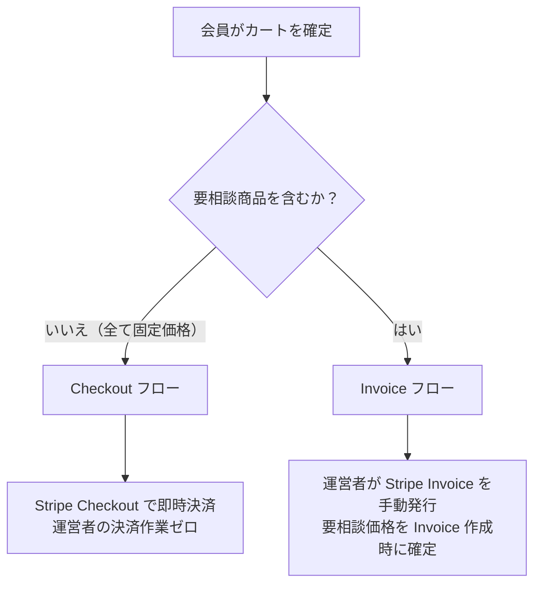
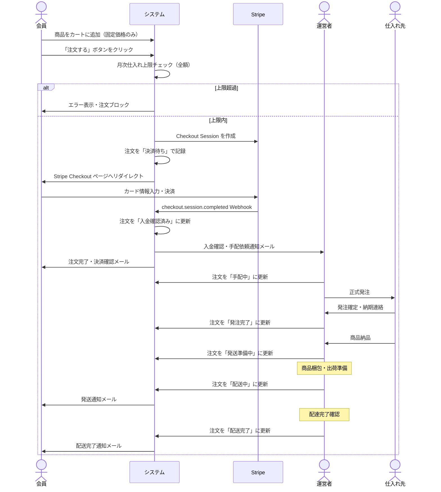
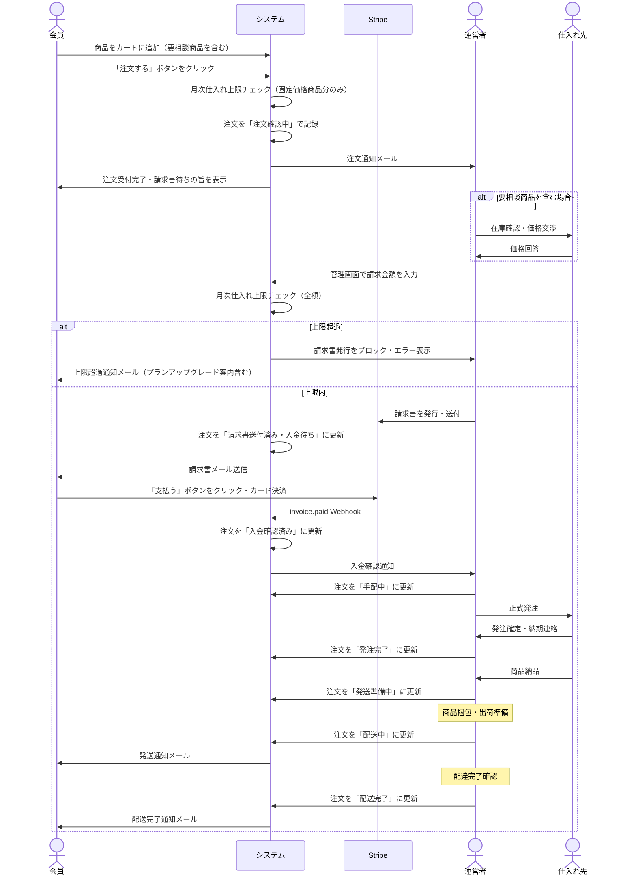

# 注文・手配フロー

## 前提

- **無在庫転売型**: 会員から注文を受けた後、運営者が仕入れ先に発注する
- **2つの決済フロー**: 注文内容によって自動分岐する
  - **Checkout フロー**: 全商品が固定価格 → Stripe Checkout で即時決済（運営者の決済作業ゼロ）
  - **Invoice フロー**: 要相談商品を1つでも含む → 運営者が Stripe Invoice を手動発行
- **要相談商品**: 価格が未確定の商品。運営者が仕入れ先と価格確認後、Invoice 作成時に金額を記入する

---

## 決済フローの分岐



---

## 注文ステータス

| #   | ステータス        | 表示名                   | 意味                                             | 使用フロー    |
| --- | ----------------- | ------------------------ | ------------------------------------------------ | ------------- |
| 1   | `pending_payment` | 決済待ち                 | Stripe Checkout Session 作成済み・決済前         | Checkout のみ |
| 2   | `confirming`      | 注文確認中               | 注文受付。運営者が内容を確認中                   | Invoice のみ  |
| 3   | `invoice_sent`    | 請求書送付済み・入金待ち | 運営者が Stripe Invoice を発行・送付済み         | Invoice のみ  |
| 4   | `paid`            | 入金確認済み             | 決済完了（Webhook で自動更新）                   | 両フロー      |
| 5   | `sourcing`        | 手配中                   | 仕入れ先への手配を開始                           | 両フロー      |
| 6   | `ordered`         | 発注完了                 | 仕入れ先への発注が完了                           | 両フロー      |
| 7   | `preparing`       | 発送準備中               | 商品の梱包・出荷準備中                           | 両フロー      |
| 8   | `shipping`        | 配送中                   | 配送業者に引き渡し済み                           | 両フロー      |
| 9   | `delivered`       | 配送完了                 | 会員への配達完了                                 | 両フロー      |
| —   | `cancelled`       | キャンセル               | 任意のステップで運営者またはシステムがキャンセル | 両フロー      |

---

## Checkout フロー（全商品が固定価格）



---

## Invoice フロー（要相談商品を含む）



---

## ステータス遷移

```
【Checkout フロー】
pending_payment → paid → sourcing → ordered → preparing → shipping → delivered
      ↓              ↓
  cancelled      cancelled（決済完了後は Stripe 返金処理が必要）

【Invoice フロー】
confirming → invoice_sent → paid → sourcing → ordered → preparing → shipping → delivered
    ↓              ↓         ↓
cancelled      cancelled  cancelled（入金後キャンセルは返金処理が必要）
```

### 遷移のトリガー

| 遷移                 | トリガー                                     | 備考                          |
| -------------------- | -------------------------------------------- | ----------------------------- |
| → `pending_payment`  | 会員が注文確定（Checkout フロー）            | Checkout Session 作成と同時   |
| → `confirming`       | 会員が注文完了（Invoice フロー）             | システムが自動で作成          |
| → `invoice_sent`     | 運営者が管理画面で Invoice 発行              | 要相談商品の価格交渉後に実施  |
| → `paid`（Checkout） | Stripe `checkout.session.completed` Webhook  | システムが自動で更新          |
| → `paid`（Invoice）  | Stripe `invoice.paid` Webhook                | システムが自動で更新          |
| → `sourcing` 以降    | 運営者が管理画面で手動更新                   | —                             |
| → `cancelled`        | 運営者が管理画面で手動、または決済キャンセル | 入金後は Stripe Refund も必要 |

---

## 商品タイプと価格

| タイプ           | カート表示                           | 決済方法                                      |
| ---------------- | ------------------------------------ | --------------------------------------------- |
| **固定価格商品** | ランク別価格を表示                   | Checkout フロー（全商品が固定価格の場合）     |
| **要相談商品**   | 「価格要相談」と表示（数量のみ指定） | Invoice フロー（要相談商品を1つでも含む場合） |

---

## 設計決定事項

| #   | 項目                   | 決定内容                                                                                                                                               |
| --- | ---------------------- | ------------------------------------------------------------------------------------------------------------------------------------------------------ |
| 1   | 決済フローの分岐       | 要相談商品の有無で自動判定。混在注文は必ず Invoice フロー。フロー情報は `Order.payment_flow` に記録する                                                |
| 2   | Invoice の支払い期限   | デフォルト7日。運営者が Invoice 発行時に個別変更可能                                                                                                   |
| 3   | キャンセル・返金       | 原則返金なし。例外対応は運営者が個別に判断（システム外で処理）                                                                                         |
| 4   | ステータス変更通知     | メール通知 + マイページ表示の両方                                                                                                                      |
| 5   | 月次仕入れ上限チェック | Checkout フロー：注文確定時に全額チェック。Invoice フロー：注文時に固定価格分のみチェック、Invoice 発行時に全額チェック                                |
| 6   | 要相談商品の価格記録   | システムで時価管理はしない。Invoice 作成時に運営者が入力した金額を注文明細にスナップショットとして記録し、月次集計に加算する                           |
| 7   | 上限超過時の会員通知   | システムが自動でメール通知。内容は上限超過のお知らせ + プランアップグレードの案内                                                                      |
| 8   | abandoned な Checkout  | Session 作成から30分以内に `checkout.session.completed` が届かない場合、`pending_payment` の注文を `cancelled` に更新するバッチを実装する（フェーズ2） |
