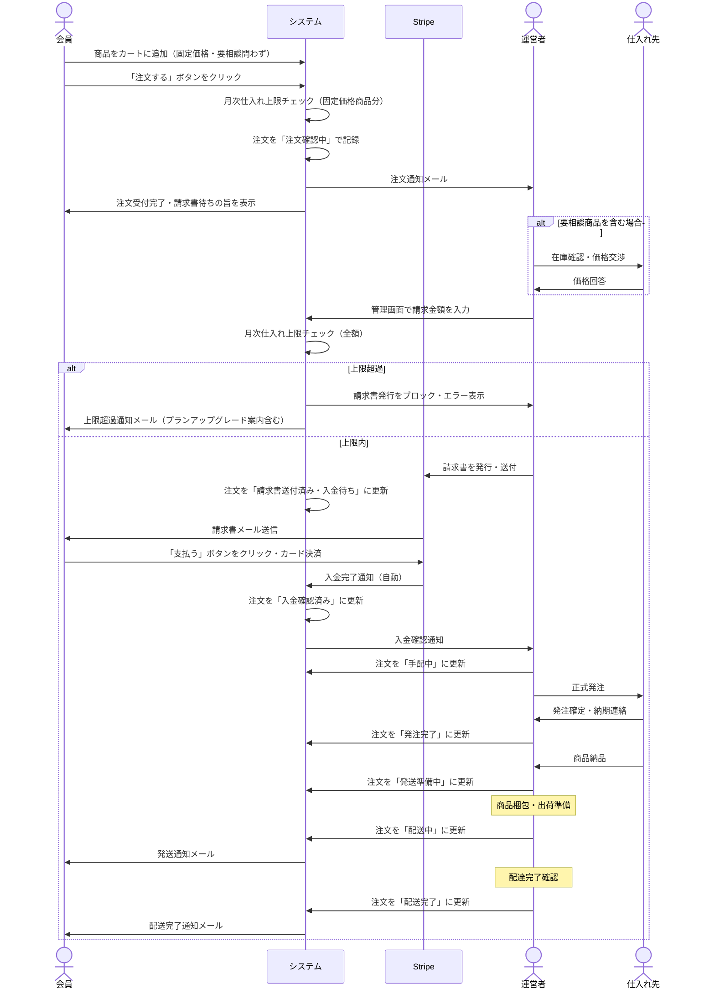

# 注文・手配フロー

## 前提

- **無在庫転売型**: 会員から注文を受けた後、運営者が仕入れ先に発注する
- **請求書払い**: 運営者が Stripe Invoice を発行し、会員が支払う（注文時に決済しない）
- **単一フロー**: 固定価格商品・要相談商品を問わず、全注文が同じ8ステップを通る
- **要相談商品**: カートに追加・注文はできるが価格が未確定。運営者が仕入れ先と確認してから請求書に金額を記載する

---

## 注文ステータス

| #   | ステータス     | 表示名                   | 意味                                             |
| --- | -------------- | ------------------------ | ------------------------------------------------ |
| 1   | `confirming`   | 注文確認中               | 注文を受け付け、運営者が内容を確認中             |
| 2   | `invoice_sent` | 請求書送付済み・入金待ち | 運営者が Stripe Invoice を発行・送付済み         |
| 3   | `paid`         | 入金確認済み             | Stripe Invoice の支払いを確認済み                |
| 4   | `sourcing`     | 手配中                   | 仕入れ先への手配を開始                           |
| 5   | `ordered`      | 発注完了                 | 仕入れ先への発注が完了                           |
| 6   | `preparing`    | 発送準備中               | 商品の梱包・出荷準備中                           |
| 7   | `shipping`     | 配送中                   | 配送業者に引き渡し済み                           |
| 8   | `delivered`    | 配送完了                 | 会員への配達完了                                 |
| —   | `cancelled`    | キャンセル               | 任意のステップで運営者またはシステムがキャンセル |

---

## 注文フロー



---

## ステータス遷移

```
confirming → invoice_sent → paid → sourcing → ordered → preparing → shipping → delivered
     ↓              ↓        ↓
  cancelled      cancelled  cancelled（入金後キャンセルは返金処理が必要）
```

### 遷移のトリガー

| 遷移              | トリガー                                     | 備考                          |
| ----------------- | -------------------------------------------- | ----------------------------- |
| → `confirming`    | 会員が注文完了                               | システムが自動で作成          |
| → `invoice_sent`  | 運営者が管理画面で Invoice 発行              | 要相談商品の価格交渉後に実施  |
| → `paid`          | Stripe `invoice.paid` Webhook                | システムが自動で更新          |
| → `sourcing` 以降 | 運営者が管理画面で手動更新                   | —                             |
| → `cancelled`     | 運営者が管理画面で手動、または決済キャンセル | 入金後は Stripe Refund も必要 |

---

## 商品タイプと価格

| タイプ           | カート表示                           | 請求書の金額                                  |
| ---------------- | ------------------------------------ | --------------------------------------------- |
| **固定価格商品** | ランク別価格を表示                   | Sanity に登録されたランク別価格をそのまま使用 |
| **要相談商品**   | 「価格要相談」と表示（数量のみ指定） | 運営者が仕入れ先確認後に Invoice 作成時に入力 |

---

## 設計決定事項

| #   | 項目                   | 決定内容                                                                                                                                                                        |
| --- | ---------------------- | ------------------------------------------------------------------------------------------------------------------------------------------------------------------------------- |
| 1   | Invoice の支払い期限   | デフォルト7日。運営者が Invoice 発行時に個別変更可能                                                                                                                            |
| 2   | キャンセル・返金       | 原則返金なし。例外対応は運営者が個別に判断（システム外で処理）                                                                                                                  |
| 3   | ステータス変更通知     | メール通知 + マイページ表示の両方                                                                                                                                               |
| 4   | 月次仕入れ上限チェック | ハードルール。固定価格商品は注文時にシステムが自動チェック。要相談商品は Invoice 作成時に運営者が金額を入力した時点でシステムが自動チェックし、超過する場合は発行をブロックする |
| 5   | 要相談商品の価格記録   | システムで時価管理はしない。Invoice 作成時に運営者が入力した金額を注文明細にスナップショットとして記録し、月次集計に加算する                                                    |
| 6   | 上限超過時の会員通知   | システムが自動でメール通知。内容は上限超過のお知らせ + プランアップグレードの案内                                                                                               |
