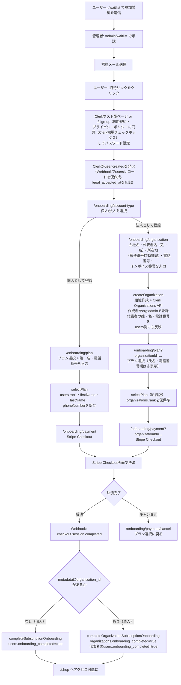
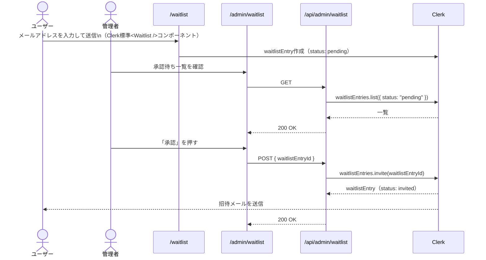
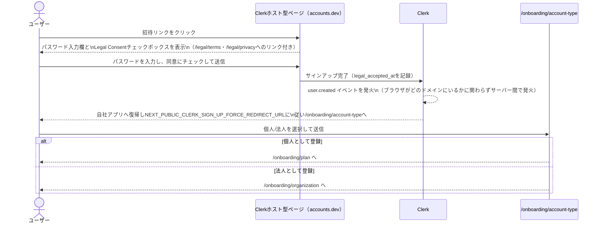
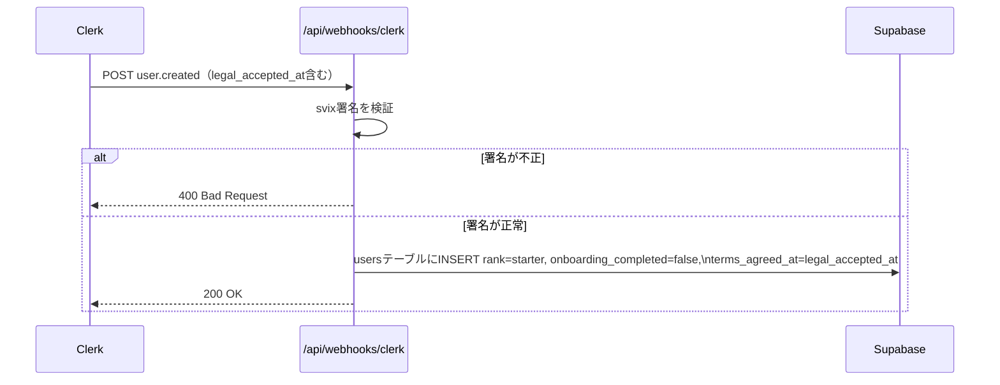
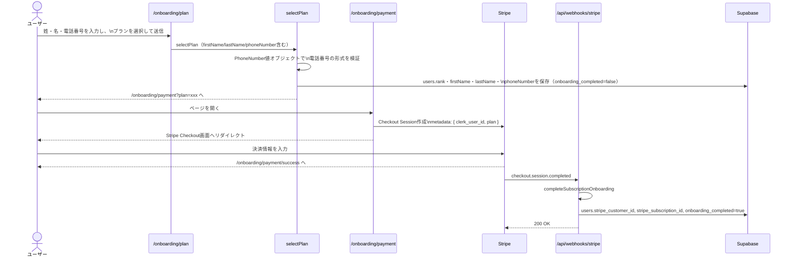
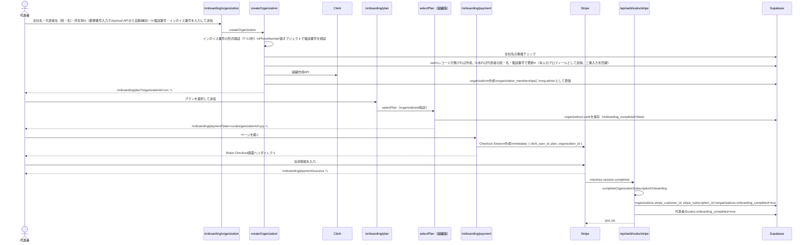

# 会員登録フロー

> 本ドキュメントは spec 005（法人会員/B2B対応）のPhase 4実装時点（個人セルフサインアップ〜プラン選択（氏名・電話番号入力含む）〜Stripe決済、および法人セルフサインアップ〜組織作成（代表者の氏名・電話番号入力含む）〜プラン選択〜Stripe決済）の実装を反映している。7ランクモデル（STARTER〜ENTERPRISE）準拠。

## 前提

- **Waitlist制**: ユーザーが`/waitlist`で参加希望を送信し、管理者が`/admin/waitlist`で承認した人のみ会員登録できる（Clerk Waitlist signup mode）。旧「管理者が直接メールアドレスを指定して招待する」方式（Restricted signup mode + `/admin/invitations`）は廃止した
- **利用規約・プライバシーポリシーの同意**: 独自ページは持たず、Clerk標準のLegal Consent機能（`compliance.legal_consent`、サインアップフォーム内蔵のチェックボックス）で必須化している。同意先URLは`/legal/terms`・`/legal/privacy`
- **個人/法人の選択**: サインアップ完了直後に個人・法人のどちらとして利用するかを選ぶ（`next.config.ts`の`NEXT_PUBLIC_CLERK_SIGN_UP_FORCE_REDIRECT_URL`で`/onboarding/account-type`へ強制遷移）
- **個人・法人は排他**: 1ユーザーが個人会員としての会員ランクと法人組織メンバーとしての所属を両方持つことはない（FR-022）
- **決済は個人・法人で共通**: どちらもStripe Checkoutで初期費用・月額費用を決済する。決済完了はStripe Webhook（`checkout.session.completed`）で非同期に確定する
- **Webhookによる非同期処理**: Clerkの`user.created`イベントでSupabaseに仮ユーザーレコードを作成する（ベストエフォート配信のため、各Server Action側でも整合性を保証する）。同イベントの`legal_accepted_at`を`users.terms_agreed_at`にそのまま転記する
- **氏名・電話番号の必須化**: 個人は`/onboarding/plan`、法人代表者は`/onboarding/organization`で、それぞれのオンボーディング画面内で収集する。既存会員への遡及対応（本番未リリースのため対象ユーザーなし）は本リリースのスコープ外（詳細は`specs/005-b2b-organization/spec.md`のFR-020参照）

---

## フロー全体図

---

## フェーズ1: 参加希望送信・管理者承認

> **Note:** `waitlistEntries.invite()`は`createInvitation()`と異なり`redirectUrl`を指定できない（Clerk Backend APIの仕様上のパラメータが存在しない）。そのため招待リンクは必ずClerkのホスト型ページ（Account Portal）を一度経由してから自社アプリへ戻ってくる。実際の登録完了・`/onboarding/account-type`への到達は手動確認済み。

---

## フェーズ2: サインアップ・アカウント種別選択

---

## フェーズ3: Webhook処理（Clerk user.created、非同期）

> **Note:** Webhookはベストエフォート配信のため、`selectPlan`・`createOrganization`側でも`users`が存在しなければその場で作成することで整合性を保証している（法人登録はWebhook到達前にusersレコードへアクセスし得るため、特に重要）。

---

## フェーズ4a: 個人 — プラン選択・決済

---

## フェーズ4b: 法人 — 組織作成・プラン選択・決済

以降、組織に所属する一般担当者は個人としての会員ランク・月次上限を持たず、組織のランク・月次上限を共有する（`resolveMemberContext`経由、FR-022/FR-024）。

---

## ルーティングと公開範囲

| パス                       | 認証                                      | 説明                                                         |
| -------------------------- | ----------------------------------------- | ------------------------------------------------------------ |
| `/legal/terms`             | 不要（公開）                              | 利用規約（Clerk Legal Consentの同意先URL）                   |
| `/legal/privacy`           | 不要（公開）                              | プライバシーポリシー（同上）                                 |
| `/sign-up`                 | 不要（Waitlist modeで招待リンクのみ有効） | Clerkサインアップページ（Legal Consentチェックボックス内蔵） |
| `/sign-in`                 | 不要（公開）                              | Clerkサインインページ                                        |
| `/waitlist`                | 不要（公開）                              | Waitlist参加希望送信ページ（`<Waitlist />`）                 |
| `/onboarding/account-type` | 必要                                      | 個人/法人選択                                                |
| `/onboarding/plan`         | 必要                                      | プラン選択（個人・法人共通、`organizationId`で分岐）         |
| `/onboarding/organization` | 必要                                      | 法人情報入力                                                 |
| `/onboarding/payment`      | 必要                                      | Stripe Checkoutへのリダイレクト中継                          |
| `/admin/waitlist`          | 必要（adminロール）                       | Waitlist承認・却下ページ                                     |
| `/api/admin/waitlist`      | 必要（adminロール）                       | Waitlist一覧・承認・却下API                                  |
| `/api/webhooks/clerk`      | 不要（svix署名で検証）                    | Clerk Webhook受信エンドポイント                              |
| `/api/webhooks/stripe`     | 不要（Stripe署名で検証）                  | Stripe Webhook受信エンドポイント                             |
| `/shop`                    | 必要 + `onboarding_completed=true`        | ショップ本体                                                 |

---

## 設計決定事項

| #   | 項目                                    | 決定内容                                                                                                                                                                                                                                                                                                                                                                                                                                                                                                                                                                                           |
| --- | --------------------------------------- | -------------------------------------------------------------------------------------------------------------------------------------------------------------------------------------------------------------------------------------------------------------------------------------------------------------------------------------------------------------------------------------------------------------------------------------------------------------------------------------------------------------------------------------------------------------------------------------------------- |
| 1   | アクセス制限                            | ClerkのWaitlist signup modeで、`/waitlist`から参加希望を送信し管理者が承認した人のみサインアップ可能にする。旧「管理者が直接メールアドレスを指定して招待する」方式（`/admin/invitations`）は廃止した                                                                                                                                                                                                                                                                                                                                                                                               |
| 2   | サインアップ直後の遷移先                | `next.config.ts`の`NEXT_PUBLIC_CLERK_SIGN_UP_FORCE_REDIRECT_URL`で`/onboarding/account-type`を指定（Clerk Dashboardの設定ではない）                                                                                                                                                                                                                                                                                                                                                                                                                                                                |
| 3   | 個人/法人の判定                         | `organization_memberships`に自分のレコードが1件でもあるかで判定。動的な切り替えは発生しない（FR-022）                                                                                                                                                                                                                                                                                                                                                                                                                                                                                              |
| 4   | Webhookと Server Action の二重upsert    | Webhookはベストエフォート配信のため、`selectPlan`・`createOrganization`でも`users`をupsert/作成して整合性を保証                                                                                                                                                                                                                                                                                                                                                                                                                                                                                    |
| 5   | onboarding_completedフラグ              | 個人・法人ともにStripe決済完了（`checkout.session.completed`）まで`false`のまま。決済前にrankだけ仮保存し、確定はWebhook側で行う                                                                                                                                                                                                                                                                                                                                                                                                                                                                   |
| 6   | 法人のStripe決済                        | 個人会員と同じくCheckout Sessionで初期費用・月額費用を決済する。`organizations`テーブルに`stripe_customer_id`/`stripe_subscription_id`を保持                                                                                                                                                                                                                                                                                                                                                                                                                                                       |
| 7   | 法人登録時のusersレコード未作成対策     | 法人登録は個人の`selectPlan`を経由しないため、`user.created`Webhook到達前に`createOrganization`が呼ばれる可能性がある。その場でusersレコードを作成するフォールバックを持つ                                                                                                                                                                                                                                                                                                                                                                                                                         |
| 8   | Webhook冪等性                           | `completeSubscriptionOnboarding`・`completeOrganizationSubscriptionOnboarding`はいずれも、既に`onboarding_completed=true`なら早期returnし再配信に対して冪等                                                                                                                                                                                                                                                                                                                                                                                                                                        |
| 9   | 利用規約同意の実装                      | 独自の`/welcome`ページは廃止し、Clerk標準のLegal Consent機能（`compliance.legal_consent`、`clerk config patch`で設定）に一本化。同意日時はClerkの`legal_accepted_at`をuser.createdウェブフックで`users.terms_agreed_at`へ転記する（`selectPlan`側では上書きしない）                                                                                                                                                                                                                                                                                                                                |
| 10  | 氏名・電話番号の収集場所                | 汎用のプロフィール入力ゲート（`/profile/complete`+`middleware.ts`リダイレクト）は作らず、各オンボーディング画面内で完結させる。個人は`/onboarding/plan`に入力欄を追加。法人代表者は`/onboarding/organization`の代表者名を姓・名に分割し、その値と電話番号をそのまま本人の`users.first_name`/`last_name`/`phone_number`にも反映する（`create-organization.ts`）ため、別画面での二重入力が発生しない                                                                                                                                                                                                 |
| 11  | 電話番号のバリデーション                | `PhoneNumber`値オブジェクト（0始まりの10〜11桁、ハイフンは正規化）で個人・法人共通で検証する。不正な形式は`InvalidPhoneNumberError`                                                                                                                                                                                                                                                                                                                                                                                                                                                                |
| 12  | Restricted mode → Waitlist modeへの移行 | 管理者が能動的に招待する方式から、ユーザーが自発的に参加希望を送信し管理者が承認する方式へ変更（`docs/waitlist-migration-plan.md`）。`clerk.invitations.createInvitation()`はWaitlist mode有効化後も引き続き機能するため、E2Eテストヘルパー（`tests/e2e/helpers/clerk-test-invitation.ts`）は変更不要                                                                                                                                                                                                                                                                                              |
| 13  | Waitlist招待のredirectUrl制約           | `waitlistEntries.invite()`はBackend API仕様上`redirectUrl`を指定できない（`createInvitation()`との違い）。そのため招待リンクは必ずClerkのホスト型ページ（Account Portal）を一度経由してから自社アプリに戻る。E2Eテスト（`tests/e2e/auth/waitlist.spec.ts`）は参加希望送信〜管理者承認による招待URL発行までを検証し、ホスト型ページ経由のサインアップ完了以降は`registration.spec.ts`等の既存E2E（`createInvitation`経由・自社`/sign-up`ページ）で間接的にカバーする。理由は、Clerkのボット対策バイパス機構（`setupClerkTestingToken`）がホスト型ページへの遷移と相性が悪く自動操作が安定しないため |
