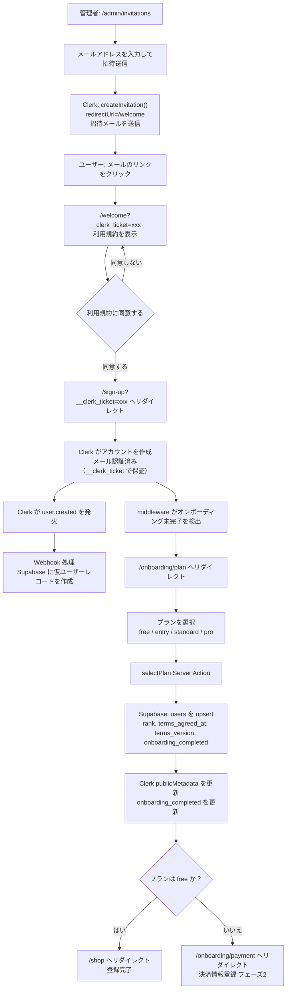
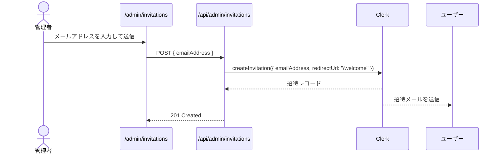
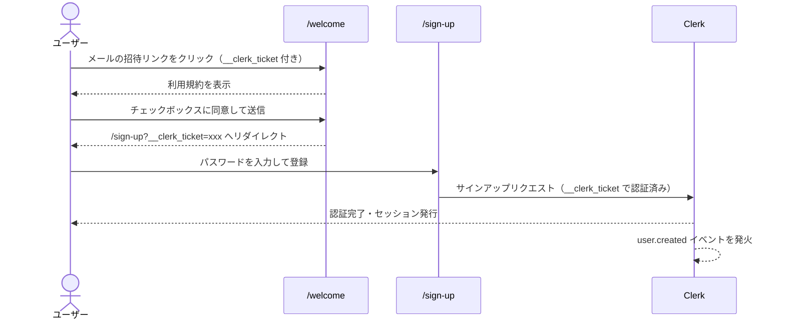
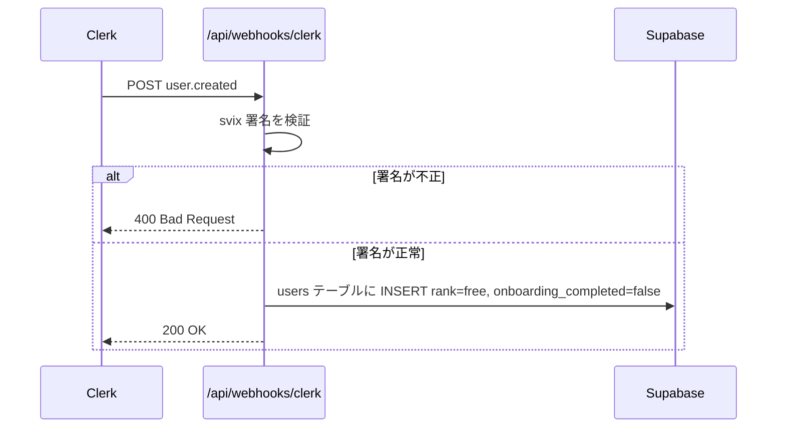
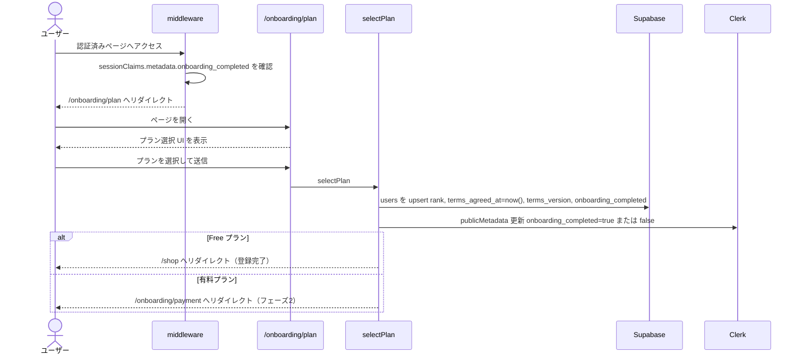

# 会員登録フロー

> ⚠️ **現状の実装について**: 本ドキュメントの「Free プラン」分岐は現在のコード実装と一致している。`service-spec.md` は7ランクモデル（STARTER〜ENTERPRISE、Free ランクなし）に更新済みだが、コード側の移行は未着手（[BRAND-97](https://linear.app/wknd-studio/issue/BRAND-97)）。移行完了後に本ドキュメントも更新すること。

## 前提

- **招待制**: 管理者が招待メールを送った人のみ会員登録できる
- **Clerk Restricted signup mode**: 招待リンク経由以外のサインアップをブロック
- **3フェーズ構成**: 利用規約同意 → Clerk アカウント作成 → オンボーディング（プラン選択）
- **Webhook による非同期処理**: Clerk の `user.created` イベントを受け取って Supabase にユーザーレコードを作成する

---

## フロー全体図

---

## フェーズ 1: 招待送信（管理者）

---

## フェーズ 2: 利用規約同意 & サインアップ

---

## フェーズ 3: Webhook 処理（非同期）

> **Note:** Webhook はベストエフォート配信のため、`selectPlan` でも `users` を upsert することで整合性を保証している。

---

## フェーズ 4: オンボーディング（プラン選択）

---

## ルーティングと公開範囲

| パス                     | 認証                                         | 説明                             |
| ------------------------ | -------------------------------------------- | -------------------------------- |
| `/welcome`               | 不要（`__clerk_ticket` で招待を検証）        | 利用規約同意ページ               |
| `/sign-up`               | 不要（Restricted mode で招待リンクのみ有効） | Clerk サインアップページ         |
| `/sign-in`               | 不要（公開）                                 | Clerk サインインページ           |
| `/onboarding/plan`       | 必要                                         | プラン選択                       |
| `/admin/invitations`     | 必要（admin ロール）                         | 招待送信ページ                   |
| `/api/admin/invitations` | 必要（admin ロール）                         | 招待送信 API                     |
| `/api/webhooks/clerk`    | 不要（svix 署名で検証）                      | Clerk Webhook 受信エンドポイント |
| `/shop`                  | 必要 + onboarding_completed=true             | ショップ本体                     |

---

## 設計決定事項

| #   | 項目                                   | 決定内容                                                                                                                                                                                                |
| --- | -------------------------------------- | ------------------------------------------------------------------------------------------------------------------------------------------------------------------------------------------------------- |
| 1   | アクセス制限                           | Clerk の Restricted signup mode で招待リンク以外のサインアップをブロック                                                                                                                                |
| 2   | 利用規約同意のタイミング               | サインアップ前（`/welcome`）で同意を取得。同意日時を URL パラメータで `/sign-up` へ渡し、オンボーディング完了時に DB へ記録                                                                             |
| 3   | terms_agreed_at の記録タイミング       | `/welcome` でユーザーが同意し、`selectPlan` 実行時刻を `terms_agreed_at` として DB に記録。Restricted mode により招待フロー（`/welcome`）を経由しないサインアップはブロックされるため整合性を保証できる |
| 4   | Webhook と Server Action の二重 upsert | Webhook はベストエフォート配信のため、`selectPlan` でも `users` を upsert して整合性を保証                                                                                                              |
| 5   | onboarding_completed フラグ            | Clerk の `publicMetadata` に保持し middleware で参照。free プランは即 `true`、有料プランは決済完了後に `true`（フェーズ2）                                                                              |
| 6   | 有料プランの決済                       | `/onboarding/payment` での Stripe 決済フローはフェーズ2で実装                                                                                                                                           |
