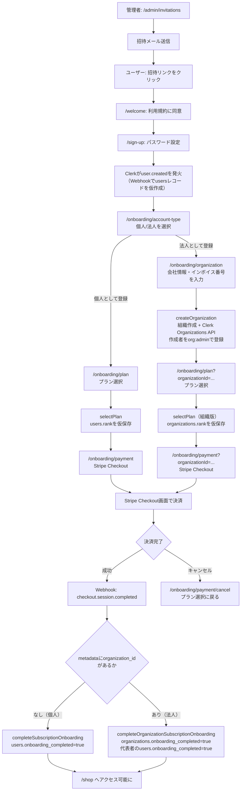
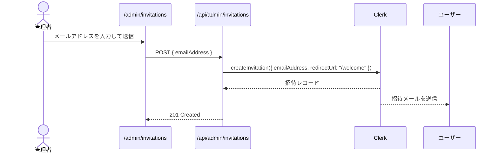
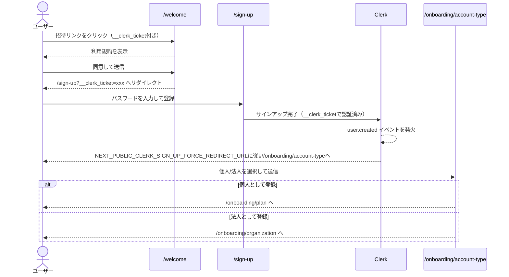
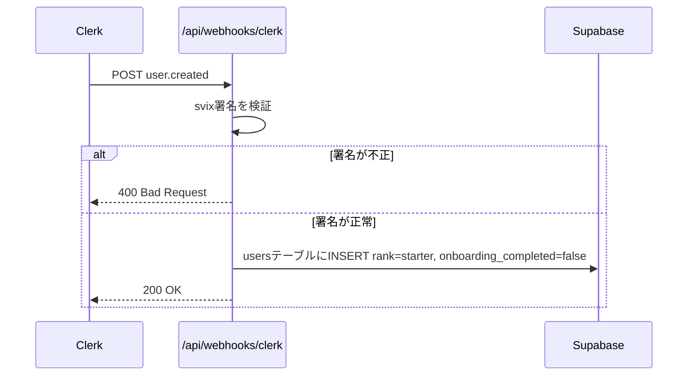
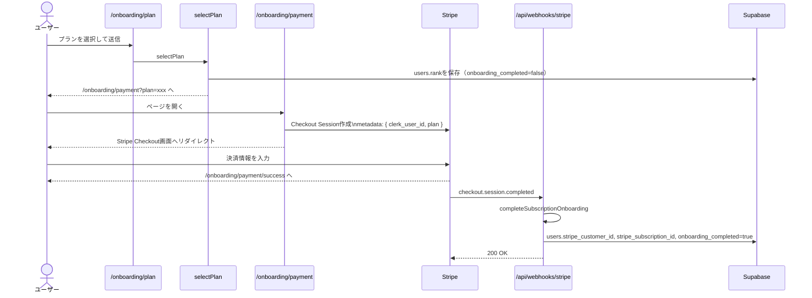
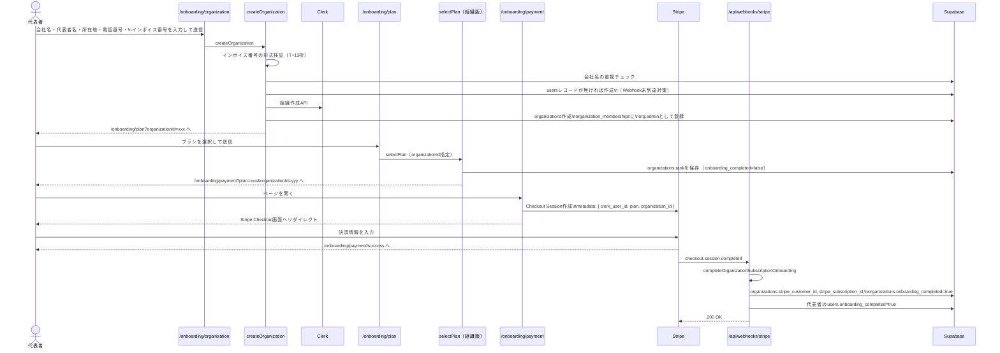

# 会員登録フロー

> 本ドキュメントは spec 005（法人会員/B2B対応）のPhase 3実装時点（個人セルフサインアップ〜プラン選択〜Stripe決済、および法人セルフサインアップ〜組織作成〜プラン選択〜Stripe決済）の実装を反映している。7ランクモデル（STARTER〜ENTERPRISE）準拠。

## 前提

- **招待制**: 管理者が招待メールを送った人のみ会員登録できる（Clerk Restricted signup mode）
- **個人/法人の選択**: サインアップ完了直後に個人・法人のどちらとして利用するかを選ぶ（`next.config.ts`の`NEXT_PUBLIC_CLERK_SIGN_UP_FORCE_REDIRECT_URL`で`/onboarding/account-type`へ強制遷移）
- **個人・法人は排他**: 1ユーザーが個人会員としての会員ランクと法人組織メンバーとしての所属を両方持つことはない（FR-022）
- **決済は個人・法人で共通**: どちらもStripe Checkoutで初期費用・月額費用を決済する。決済完了はStripe Webhook（`checkout.session.completed`）で非同期に確定する
- **Webhookによる非同期処理**: Clerkの`user.created`イベントでSupabaseに仮ユーザーレコードを作成する（ベストエフォート配信のため、各Server Action側でも整合性を保証する）

---

## フロー全体図

---

## フェーズ1: 招待送信（管理者）

---

## フェーズ2: 利用規約同意・サインアップ・アカウント種別選択

---

## フェーズ3: Webhook処理（Clerk user.created、非同期）

> **Note:** Webhookはベストエフォート配信のため、`selectPlan`・`createOrganization`側でも`users`が存在しなければその場で作成することで整合性を保証している（法人登録はWebhook到達前にusersレコードへアクセスし得るため、特に重要）。

---

## フェーズ4a: 個人 — プラン選択・決済

---

## フェーズ4b: 法人 — 組織作成・プラン選択・決済

以降、組織に所属する一般担当者は個人としての会員ランク・月次上限を持たず、組織のランク・月次上限を共有する（`resolveMemberContext`経由、FR-022/FR-024）。

---

## ルーティングと公開範囲

| パス                       | 認証                                        | 説明                                                 |
| -------------------------- | ------------------------------------------- | ---------------------------------------------------- |
| `/welcome`                 | 不要（`__clerk_ticket`で招待を検証）        | 利用規約同意ページ                                   |
| `/sign-up`                 | 不要（Restricted modeで招待リンクのみ有効） | Clerkサインアップページ                              |
| `/sign-in`                 | 不要（公開）                                | Clerkサインインページ                                |
| `/onboarding/account-type` | 必要                                        | 個人/法人選択                                        |
| `/onboarding/plan`         | 必要                                        | プラン選択（個人・法人共通、`organizationId`で分岐） |
| `/onboarding/organization` | 必要                                        | 法人情報入力                                         |
| `/onboarding/payment`      | 必要                                        | Stripe Checkoutへのリダイレクト中継                  |
| `/admin/invitations`       | 必要（adminロール）                         | 招待送信ページ                                       |
| `/api/admin/invitations`   | 必要（adminロール）                         | 招待送信API                                          |
| `/api/webhooks/clerk`      | 不要（svix署名で検証）                      | Clerk Webhook受信エンドポイント                      |
| `/api/webhooks/stripe`     | 不要（Stripe署名で検証）                    | Stripe Webhook受信エンドポイント                     |
| `/shop`                    | 必要 + `onboarding_completed=true`          | ショップ本体                                         |

---

## 設計決定事項

| #   | 項目                                 | 決定内容                                                                                                                                                                   |
| --- | ------------------------------------ | -------------------------------------------------------------------------------------------------------------------------------------------------------------------------- |
| 1   | アクセス制限                         | ClerkのRestricted signup modeで招待リンク以外のサインアップをブロック                                                                                                      |
| 2   | サインアップ直後の遷移先             | `next.config.ts`の`NEXT_PUBLIC_CLERK_SIGN_UP_FORCE_REDIRECT_URL`で`/onboarding/account-type`を指定（Clerk Dashboardの設定ではない）                                        |
| 3   | 個人/法人の判定                      | `organization_memberships`に自分のレコードが1件でもあるかで判定。動的な切り替えは発生しない（FR-022）                                                                      |
| 4   | Webhookと Server Action の二重upsert | Webhookはベストエフォート配信のため、`selectPlan`・`createOrganization`でも`users`をupsert/作成して整合性を保証                                                            |
| 5   | onboarding_completedフラグ           | 個人・法人ともにStripe決済完了（`checkout.session.completed`）まで`false`のまま。決済前にrankだけ仮保存し、確定はWebhook側で行う                                           |
| 6   | 法人のStripe決済                     | 個人会員と同じくCheckout Sessionで初期費用・月額費用を決済する。`organizations`テーブルに`stripe_customer_id`/`stripe_subscription_id`を保持                               |
| 7   | 法人登録時のusersレコード未作成対策  | 法人登録は個人の`selectPlan`を経由しないため、`user.created`Webhook到達前に`createOrganization`が呼ばれる可能性がある。その場でusersレコードを作成するフォールバックを持つ |
| 8   | Webhook冪等性                        | `completeSubscriptionOnboarding`・`completeOrganizationSubscriptionOnboarding`はいずれも、既に`onboarding_completed=true`なら早期returnし再配信に対して冪等                |
